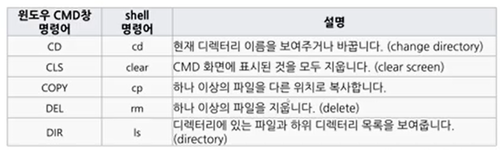

[toc]

# 210118

## cmd명령어

microsoft store 에서 ubuntu 설치하면 리눅스 명령어를 사용할 수 있다.(cmder도 비슷한거 같음)

cmder를 사용할 때는 conda activate base 를 통해서 가상환경을 설정해주자

## jypyter 

conda에서 설치시

conda install jupyter 입력

실행시에는

jupyter notebook 입력

단축키

shift + tap: 툴팁표시

ctrl + ] : 줄 들여쓰기

ctrl + [ : 들여쓰기 해제

shift + m : 셀 합치기