[toc]

# 210129

## 새로 배운내용

### 1.모수 vs 비모수 방법론

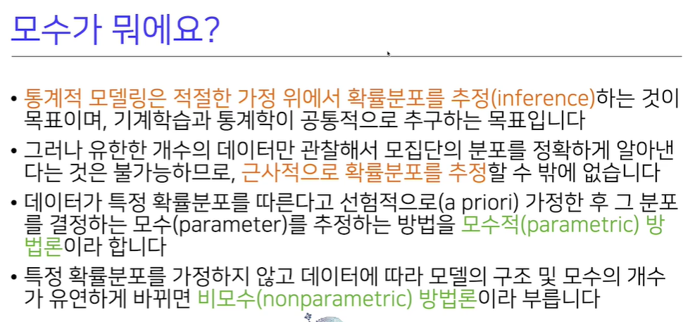

비모수 방법론이라 해서 모수가 없다는 것이 아님

### 2.정규분포 모수 추정(평균, 분산)

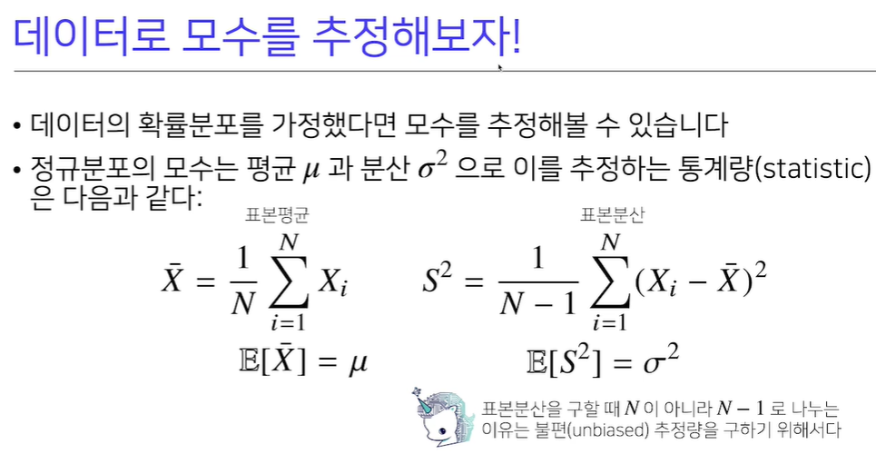

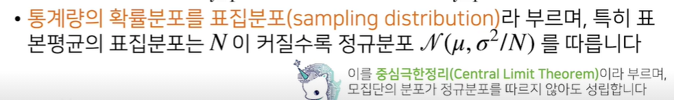

분산을 추정할때 N으로 나누는 것이 아니라 N-1로 나누는 것에 유의하자.

sample distribution과 sapling distribution은 다르고, 각각 표본분포, 표집분포로 해석하는듯 하다.

표본의 분포는 정규분포를 따르지 않더라도 표본평균의 확률분포가 정규분포를 따르는 것이 중심극한정리 인듯

### 3.로그가능도를 사용하는 이유

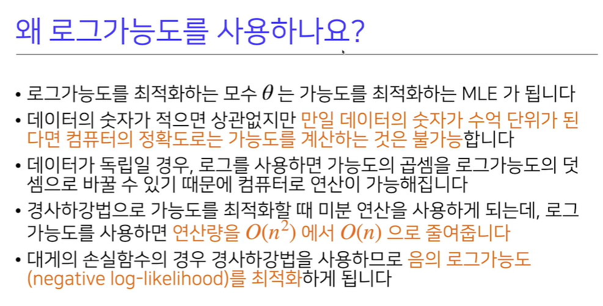

0~1사이의 값을 계속 곱하는 것은 오차를 크게 만든다.

최적화의 관점에서 연산량을 줄일 수 있다.

### 4.딥러닝에서 최대가능도 추정법

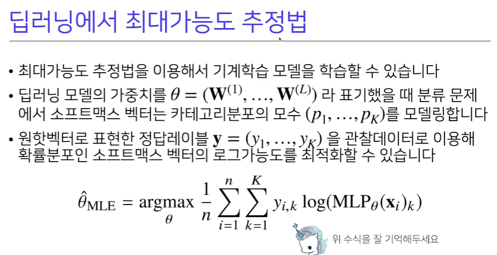

소프트맥스 벡터를 이용해 카테고리분포의 모수를 (최대가능도 추정법을 통해) 모델링 할 수 있다.

입력이 들어오면 모델링된 모수들을 통해 출력을 내 놓을 수 있다는 뜻인듯하다.

### 5.기계학습에 사용하는 손실함수는 어떻게 나왔을까?

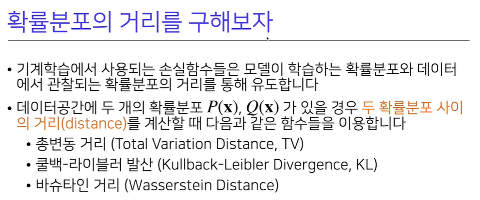

아무 손실함수나 넣다보니 좋은 손실함수를 찾은 것이 아니라

확률분포사이의 거리를 정의하고, 그 거리를 줄일 수 있도록 손실함수가 계산됐다는 것 같다.

### 6.쿨백-라이블러 발산

[궁금한점](#3.쿨백-라이블러 발산은 두 확률분포 사이의 거리를 대표할 수 있는 값이 맞나?)

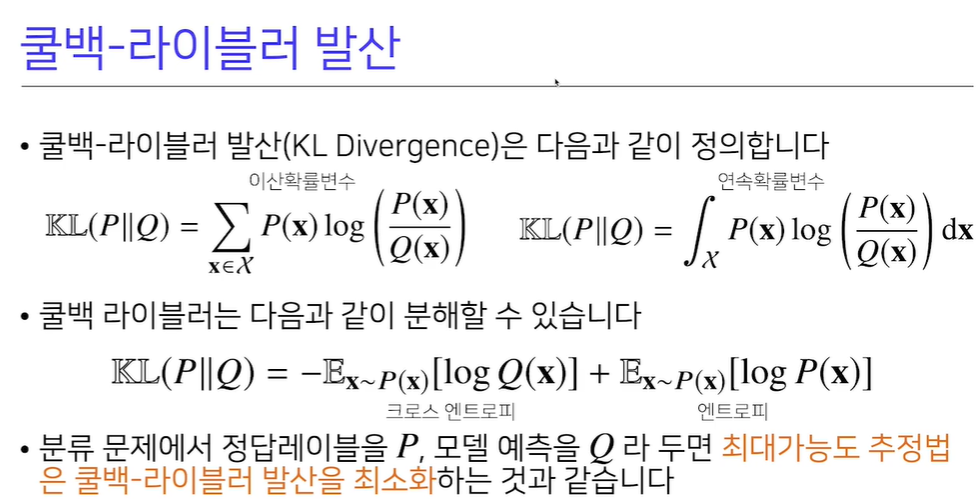

## 참고용

### 1.최대가능도 추정법

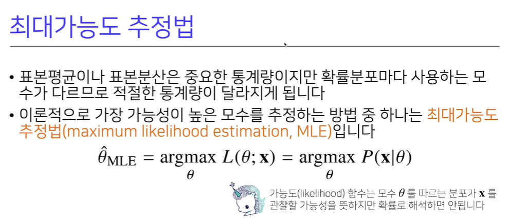

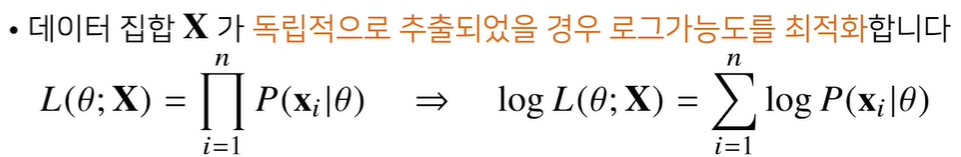

확률로 해석하면 안된다는 뜻은 theta에 대해서 적분을 하거나 합을 계산했을때 1이 아닐 수 있기 때문이다.

### 2.최대가능도 추정법 예제들

[궁금한점](#1.라그랑주 승수법은 언제 사용할 수 있을까?)

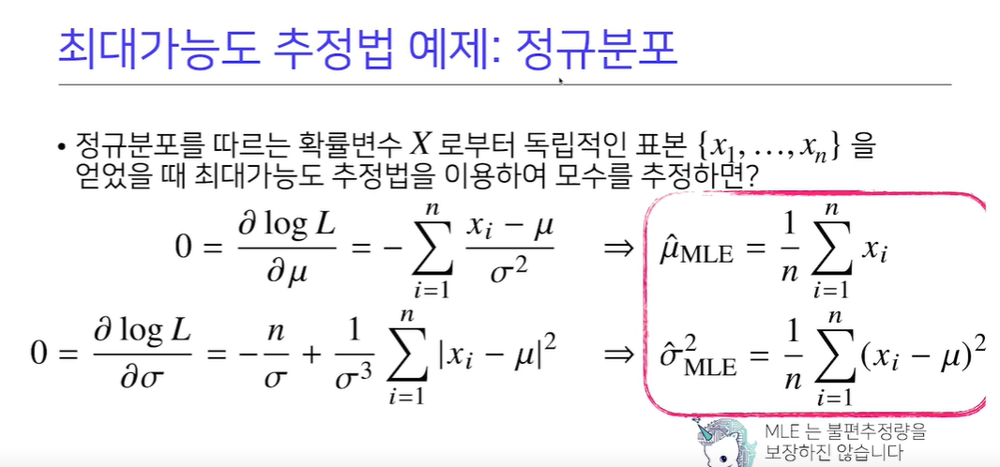

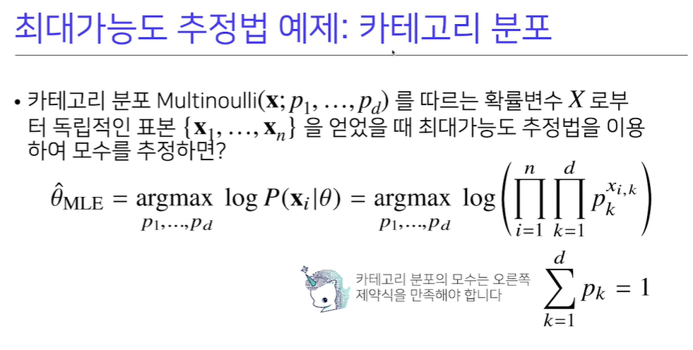

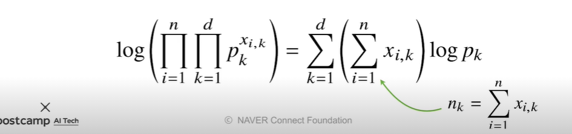

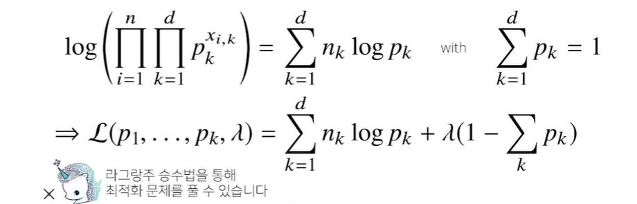

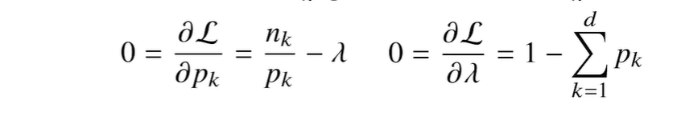

## 궁금한 점

### 1.라그랑주 승수법은 언제 사용할 수 있을까?

[돌아가기](#2.최대가능도 추정법 예제들)

### 2.거리라는 개념이 자주 등장하는 것 같은데, 측도론을 따로 공부하는게 좋을까?

### 3.쿨백-라이블러 발산은 두 확률분포 사이의 거리를 대표할 수 있는 값이 맞나?

[돌아가기](#6.쿨백-라이블러 발산)

거리공간의 대칭성에 부합하지 않는거 같은데..

부호만 바뀌는걸로 봐서 Q가 얼마나 이동해야 하는지를 나타내는 것 같기도 하다.

