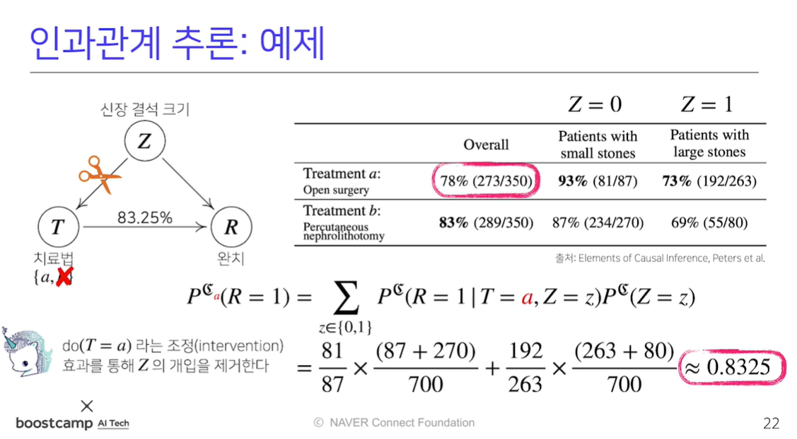
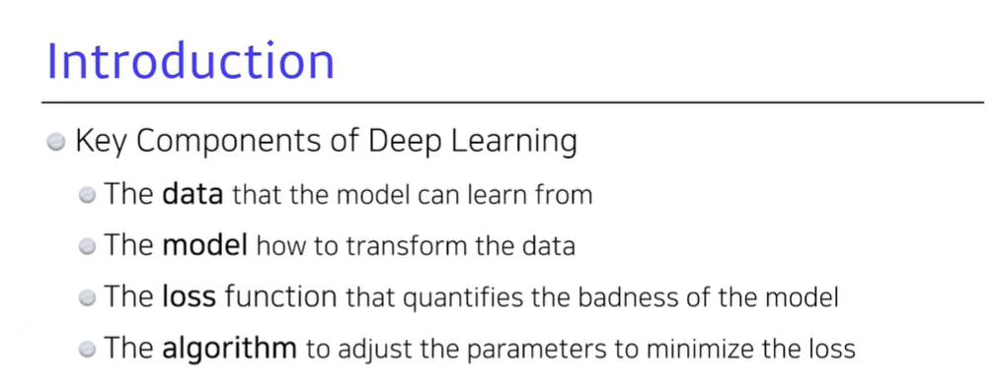
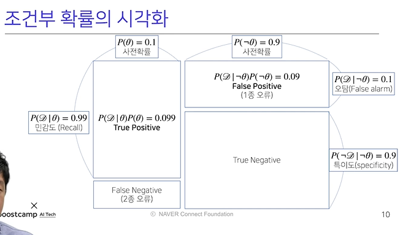
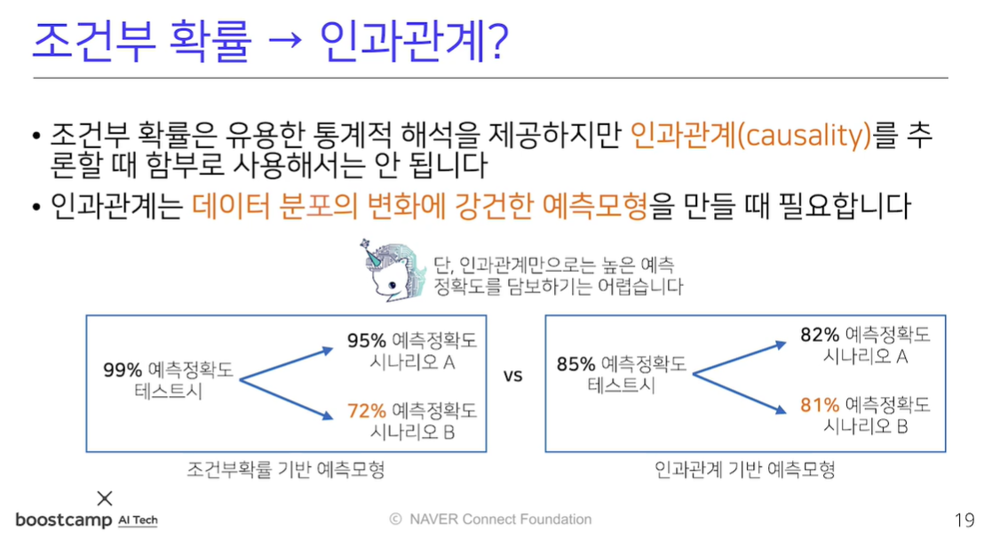
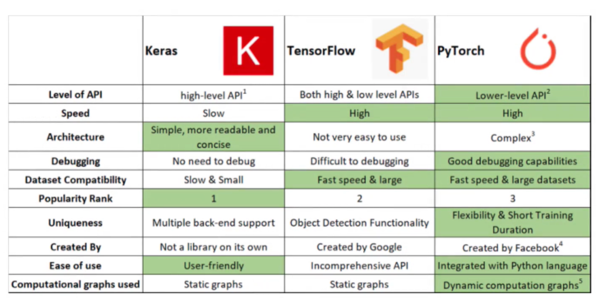

[toc]

# 210201

## 새로 배운내용

### 1. 인과관계 예제

치료법 a와 b 각각의 치료율을 보면 결석이 작은경우, 큰경우 모두 a의 치료율이 높지만, 합쳐서 보면 b의 치료율이 높다. 각 치료법에 따라 결석이 작은경우와 큰 경우의 가중치가 다르기 때문에 생긴 일.

Z의 영향을 없애기 위해 모든 사람이 a치료를 받았을때와, b치료를 받았을때를 나누어 확률을 계산한다.

### 2.key component

## 참고용

### 1.1종 오류, 2종 오류

그림에서 보듯이 실제로는 아니지만 맞다고 판단하는 경우를 1종오류

실제로 맞지만 아니라고 판단하는 경우를 2종오류라고 한다.

데이터분석의 성격에 따라 1종오류와 2종오류 중 어떤것을 더 작게 만드는지가 중요해진다.

### 2.인과관계

### 3. Keras, Tensorflow, PyTorch

## 궁금한 점

