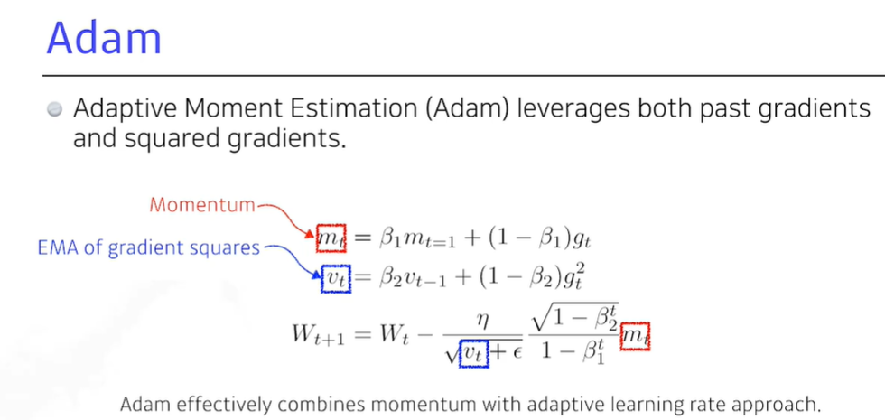
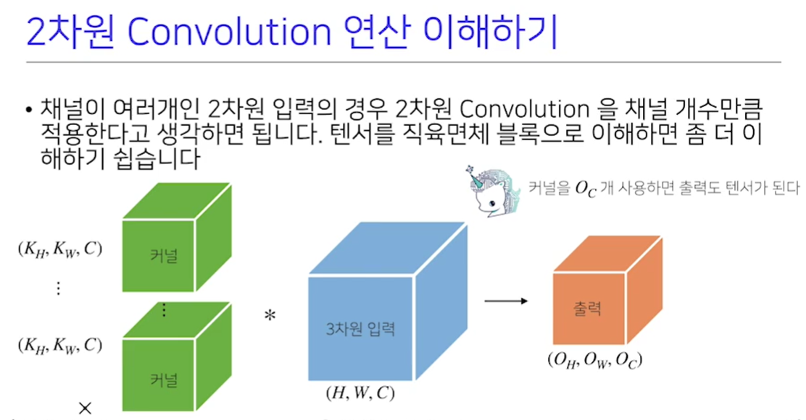

[toc]

# 210202

## 새로 배운내용

#### 1.batch size. large or small

큰 배치사이즈를 사용하면 sharp minimizer에 도달하고

작은 배치사이즈를 사용하면 flat minimizer에 도달한다.

flat minimizer에 도달하는것이 일반화성능이 좋기때문에 작은 배치사이즈를 사용하는 것이 일반적으로 더 좋다.

### learning rate

#### momentum

learning rate 에서 관성을 유지해준다.

관성을 계속 유지하면 수렴하지 못하고 진동할 가능성도 있다.

#### NAG

가려고하는 방향으로 한번 가보고, 거기서 기울기를 계산해서 업데이트한다.

#### Adagrad

현재까지 많이 변한 가중치는 조금 업데이트하고, 조금 변한 가중치는 많이 업데이트 해준다.

문제점은 G는 단조증가이므로 무한대로 가면 업데이트가 거의 일어나지 않게된다.

#### Adadelta

현재까지 모든 변수의 업데이트를 저장하는 것이 아니라, 이전 몇개의 업데이트만 가지고 계산한다.

문제점은 예를들어 이전 100개의 항을 가지고 업데이트를 한다하면, 이전 100개의 항을 전부 기억해야 하므로 메모리가 많이 필요하게 된다.

따라서 이전 정보를 모두 정확히 기억하고 있는것이 아니라 Exponential Moving Average를 사용한다. 

https://ko.wikipedia.org/wiki/%EC%9D%B4%EB%8F%99%ED%8F%89%EA%B7%A0 에서

단순이동편균과 지수이동평균을 참조하면 이해가 쉽다.

Adadelta는 learning rate가 없어서 잘 사용하지는 않는다.

#### RMSprop

Adagrad와 stepsize만 다름[궁금한 점](#RMSprop에서 stepsize가 왜 에타에 표시했을까?)

#### Adam

일반적으로 가장 무난하게 사용함

gradient squares 를 Exponential Moving Average로 가져감과 동시에 momentum을 함꼐 활용한다.

첫번째 수식에 t=1이 아니고 t -1 인것 같다.

이 부분은 수학적으로 집어넣은 항이고 딱히 의미는 없음.

입실론은 default 값을 사용하는 것이 아니고 잘 바꿔주는 것이 중요하다.

### Regularization

Generalization을 잘 되게 하고싶어서 나온 방법(학습을 방해 하는것)

#### Early stopping

validation error가 커지면 학습을 중단하는 방법

#### Parameter norm penalty(weight decay)

Parameter가 커지는 것을 방지

해석적인 의미로는 신경망이 만들어내는 함수가 부드러운 함수가 되게 하는것이고

부드러운 함수가 Generalization performance가 좋을 것이라는 가정이 깔려있다.

#### Data Augmentation

데이터셋이 적으면 딥러닝이 아니라 SVM, gradient boost 등 다른 방법론이 더 좋은 효과를 낸다.

기존 데이터셋에 약간의 변형을 가해서 데이터셋을 늘리는 방법이다.

label이 변환되지 않는 조건하에서 변환을 해야한다.

(6을 180도 회전하면 9가 되므로 이런 변환은 하면 안됨)

#### Noise Robustness

noise를 섞어주는 방법인데 왜 잘되는지는 모르겠고, 해보니 잘됨

Data Augmentaion과 다른점은 데이터셋에만 적용하는 것이아니라 

weight에도 노이즈를 섞어준다. (흔들어 준다.)

###  Label Smoothing

Data Augmentaion과의 차이점은 하나의 데이터가 아니라 두개의 데이터를 섞어주는 것이다.

Decision boundary를 부드럽게 만들어주는 효과가 있다.

label도 섞어버림

Mixup은 이미지를 반투명하게 섞는것이고

Cutout은 이미지를 잘라내는것이다.

Cutmix는 영역별로 섞어서 넣는것이다.

#### Dropout

학습시 일정확률로 뉴런을 끄는것.

각각의 뉴런들이 Robust한 feature를 잡을수 있다고 해석함 (수학적으로 증명되지는 않음)

#### Batch Normalization

논란이 많은 논문이긴함.

적용하려는 layer의 statistics를 정규화시는데 이것의 효과는 internal Covariate Shift를 줄여서 잘 학습이 된다고 설명하는데 많은 논문들이 이것에 동의하지는 않는다.

예를들어 각각의 parameter가 100의 가중치를 가지면 다 0으로 만들어버림.

하지만 성능은 잘 나옴

### Convolution

#### parameter

MLP는 fully connected라서 층이 깊어지면 parameter의 수가 너무 많아지게 된다.

convolution 연산은 kernel의 사이즈 만큼의 parameter만 있으면 된다.

여전히 선형변환이긴 함

#### 수학적인 의미

f(z) 처럼 표현된 항이 kernel이고, g(x-z)처럼 표현된 항이 signal로 해석한다.

사실 계산에서 -가 아니고 +이기 때문에 convolution이 아니고 cross-correlation인데, convolution이라 부르는 이유는 전체적인 공간에서는 +와 -는 중요하지 않다.(컴퓨터에서는 중요한데 그냥 역사적으로 convolution이라 부른다.)

#### 그래프로 보기

파란색 선이 원래 신호이고 빨간색이 커널이다. 커널이 이동하며 신호에서 부터 결과(검은색)을 추출한다.

#### 다차원 convolution

데이터의 종류에 따라 다양한 차원에서의 convolution을 사용한다.

#### 2차원 convolution 예시

아래와 같은 방법이 있고 다양한 변형이 존재한다.

#### 역전파

역전파로 계산을 하더라도 convolution은 그대로 유지된다.

### MSE를 사용한 학습

MSE를 사용하면 제곱을 사용하기 때문에 에러가 큰 값에 집중하게 되고, 작은값은 가중치가 낮아져서 아래 그림에서 파란색 선을 보면 큰 피크는 잘 맞추고 있지만, 작은 피크에서는 잘 못맞추고 있다.

## 참고용

### 1.용어

#### Generalization

training error 와 test error의 차이

#### under-fitting vs over-fiting

#### cross-validation

#### bias and variance

탄착군이 뭉쳐있으면 low variance

평균적으로 target에 접근하면 low bias

noise가 있는 경우 bias 와 variance 간에 trade off가 생긴다.

#### bootstraping

학습데이터가 고정돼있을때, subsapling을 통해 여러개의 학습모델을 만들고 전체적인 모델의 uncertaintyf를 예측하는 것

#### bagging vs boosting

둘다 bootstraping을 사용하는것 같다.

bagging은 여러 모델의 평균치를 이용해서 예측하는 것이고

boosting은 각 모델들이 잘 예측하는 부분을 다르게해서 모델을 조합하는것

- [RAdam github](https://github.com/LiyuanLucasLiu/RAdam)
- [AdamP github](https://github.com/clovaai/AdamP)

## 궁금한 점

### RMSprop에서 stepsize가 왜 에타에 표시했을까?

[돌아가기](#RMSProp)

stepsize는 G에 들어있는거 같은데..?

스텝사이즈가 학습률 얘기하는거인듯하다