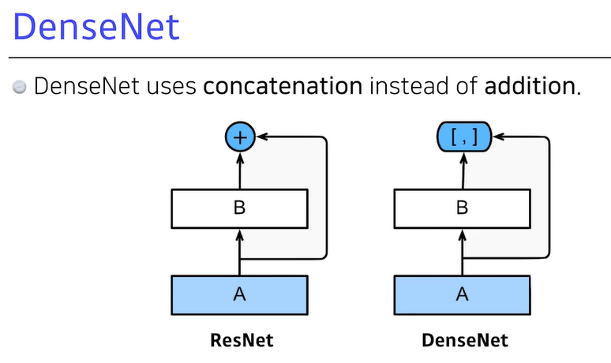
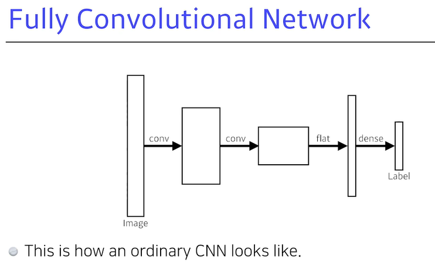
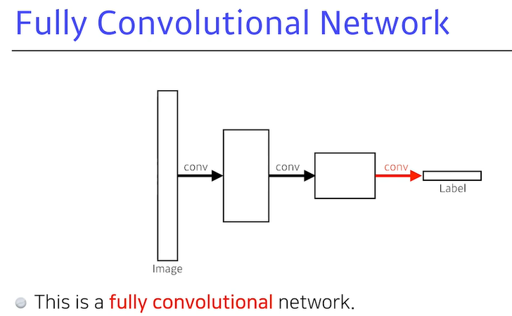

[toc]

# 210203

## 새로 배운내용

### 1.convolution 층과 fully connected 층의 역할

요즘에는 fully connected층이 없어지는 추세(파라미터가 너무 많아서)

### 2.Modern CNN

#### Alexnet

#### VGGNet

3x3 filter 2개를 사용한것은 5x5 filter를 사용한 것으로 대체가능하다.

하지만 parameter의 수는 3x3 filter 2개를 사용하는것이 더 적다.[궁금한 점](#1.3x3 conv filter vs 5x5 conv filter)

#### GoogLeNet

#### ResNet

층이 깊어도 학습을 잘 시킬수 있는 방법을 열어줬다.

#### DenseNet

#### Summary

### 3.Semantic Segmentation

정확히 conv 연산의 역연산은 존재할수 없다. 하지만 역연산이라고 생각하면 parameter의 수를 계산할때 편리하다.

### 4.Detection

R-CNN은 바운딩박스마다 AlexNet을 돌려서 여러개의 바운딩박스가 있으면 시간이 오래걸린다.

SPPNet은 이미지 전체의 conv feature map을 만들고 바운딩박스의 텐서만 가져와서 계산한다.

Fast R-CNN은 SPPNET과 거의 동일하지만 마지막에 신경망을 이용해 바운딩박스가 어떻게 움직일지, 어떤 라벨을 가지는지를 찾는다.

Faster R-CNN은 바운딩박스를 뽑아내는 것을 임의로 뽑지않고 RPN을 통해서 추출한다.

#### RPN

Anchor box는 해당 영역에 물체가 있을만한 사이즈를 뜻하고

이미지에서 해당 영역에 물체가 있을만한지 아닌지만 판단한다.

9는  Anchor box의 갯수

4는 바운딩박스의 높이, 너비, x, y축 오프셋

2는 해당 바운딩박스가 쓸모있는지 없는지

#### YOLO

바운딩박스를 뽑고 라벨을 추정하는것이 한번에 일어나서 빠르다.

## 참고용

## 궁금한 점

### 1.3x3 conv filter vs 5x5 conv filter

[돌아가기](#VGGNet)

3x3 conv filter 2개를 5x5 conv filter 하나로 대응시킬순 있지만 역으로는 아닐것이다. 그런데 왜 3x3을 쓰고 parameter의 수를 줄이는게 더 잘될까?

### 2.깊은 층과 parameter의 수

층을 깊게 쌓고 parameter의 수를 줄이면 왜 학습이 잘될까?

학습에 필요하지(중요하지) 않은 parameter를 제거해서 학습을 가능하게 하는건가?

parameter의 수가 너무 많으면 표현할 수 있는 공간에 매우 커지고, data가 공간에서 굉장히 멀리 떨어져있기 때문에 학습이 잘 안되는건가?

그러면 층의 깊이는 학습에 어떤 영향을 미치는걸까? parameter의 수는 같지만 깊은 층으로 학습하는것과 얕은 층으로 학습하는것 중에 깊은 층이 더 잘된다는 이론이 있을까?

