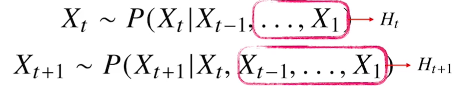
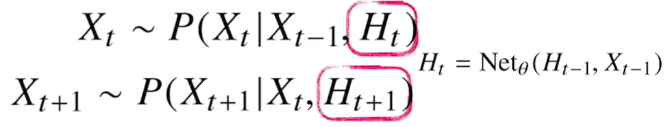
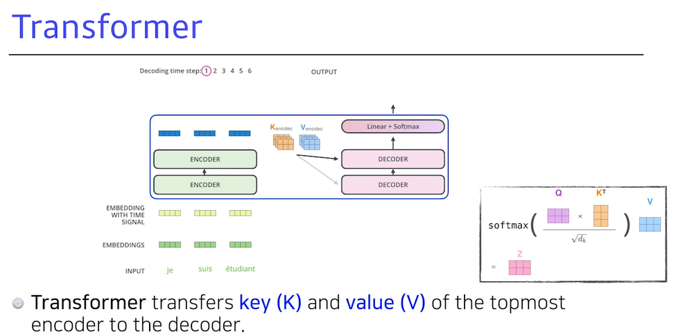

[toc]

# 210204

## 새로 배운내용

### 1.시퀀스 데이터 다루기

시퀀스 데이터를 다룬다고 해서 과거의 모든 정보가 필요한 것은 아니다.

(책을 읽을때 문장을 해석하기 위해 책의 1페이지부터 모든 문장을 다 알아야만 해석할 수 있는 것이 아님)

타우를 정하기 위해 도메인 지식이 필요한 경우도 있고, 타우가 중간에 바뀔수도 있다.

### 2.RNN

Wx WH W2는 t에 따라 변하는 가중치가 아니다.

### 3.BPTT

곱해지는 항이 많아지면 기울기가 0으로 가거나 무한대로 발산해버릴수 있어서 학습이 불안정하다.

역전파를 계산할때 계속해서 전파되는것이 아니라 어느 순간부터는 전파를 하지 않는 방법을 사용했다. 이 경우 많은 시퀀스를 고려해야 하는 경우에 부적합하다.

### 4.Sequential Model

시퀀스 데이터를 다루기 힘든점은 입력데이터의 길이를 알 수 없다는 것이다.

마르코프 모델은 직전의 데이터만 현재에 영향을 끼친다고 가정한다.

잃는 정보가 많지만, 표현이 간결하다.

hidden state를 두어서 hidden state가 과거의 정보 요약하고 있다고 생각한다.

### 5.RNN

RNN의 문제점은 과거의 정보는 적게 살아남는다는 것이다.(LeRu 사용시에는 너무 큰 값을 차지함)

### 6.LSTM

[궁금한 점](#1.-lstm에서-기울기소실-문제가-해결된건가?)

### 7.GRU

LSTM보다 적은 파라미터를 사용한다.(입력으로 받는 데이터가 2개이다.)

### 8.Transformer

시퀀스 데이터에서 중간의 정보가 소실되거나, 정보의 순서가 뒤바뀐 경우 어떻게 다룰것인가?

Transformer는 Self Attention이라는 구조를 사용한다.(Attention is All You Need)

Transformer는 특정 task에만 해당되는 것이 아니라 시퀀스 데이터를 어떻게 처리하고, 데이터를 인코딩하는 방법이다. 

#### Transformer의 적용 NMT

sequence to sequence

입력 sequence와 출력 sequence의 길이가 다를 수 있다.

RNN에서는 100개의 입력데이터가 들어오면 100번 재귀적으로 계산하지만

Transformer 구조는 한번에 처리한다. (출력을 생성할때는 한개씩 만들어낸다.)

각각의 x데이터를 z데이터로 변환하는데, 이때 xi를 zi로 바꾸기 위해 다른 x데이터들을 활용한다.

각각의 단어에서 3가지 벡터를 만들어낸다. 여기까지는 다른 단어를 고려하지 않는다.

score 벡터를 만드는데 인코딩 하려는 벡터의 Q벡터와 각 단어의 Key벡터를 내적한다.

Score 벡터의 각 원소를  dk ^ 0.5로 나눈다.

dk는 key vector의 차원을 의미한다.

그리고 Softmax함수를 적용한다.

Softmax의 값과 Value벡터를 곱해서 합하면 인코딩 완료

Multi-headed attention은 위와 같은 과정을 여러번 해서 하나의 벡터에서 여러개의 attention을 만든다.

인코딩을 여러번 하기때문에 입력과 출력의 차원을 맞춰주어야 한다.

따라서 여러개의 attention을 붙인다음 가중치행렬을 곱해 입력의 차원과 같게 만들어준다.

(실제 구현에서는 이렇게 하지 않는다.)

아직까지는 data의 순서정보를 고려한 적이 없으므로 순서를 고려해주기 위해서

positional encoding을 추가해준다.

단순 덧셈 방식으로 보인다.(순서마다 다른 positional vector를 가지는듯)

인코딩된 벡터와 기존의 X벡터를 더하고 LayerNorm을 구한다. (이것 때문에 인코딩의 입력과 출력의 차원이 같아야 하는듯)

가장 상위의 encoder에서 Key vector와 Value vector를 디코더로 보낸다.

Query Vector는 decoder가 만들어낸 단어에서 알 수 있다.

(i+1번째 단어를 만들때, i번째 단어의 Query vector와 나머지 단어들의 Key vector를 곱해서

attention을 만들고 Value vector로 weight sum을 한다.)

학습할때, 출력의 결과를 모두 알고 계산하는 것이 아니라 지금까지 출력된 결과와 그 다음단어의 라벨을 통해서 학습하는 듯 하다. (마스킹)[궁금한 점](#2.-transformer에서-첫번째-단어를-만들때는-어떤-query-vector를-쓰는지?)]

##### 요약

Q벡터와 Key벡터는 차원이 같아야한다. (Score벡터를 구할때 내적해야함)

Value 벡터는 차원이 달라도 되지만 코딩할때 편의상 같게한다.

아래 그림에서 X가 2*4 인것은 2개의 단어고 한 단어가 4차원으로 표현돼서 그렇다.

MLP나 CNN등 다른 모델과의 차이점을 생각해보면

다른 구조에서는 같은 입력에서는 같은 출력을 내게 되지만,

Transformer는 같은 입력이라 하더라도 함께 입력된 다른 데이터에 의해서 다른 출력을 낸다.

#### Transformer의 적용(이미지)

처음에는 NMT에서만 사용했지만 최근들어서 self attention이라는 구조를 이미지 도메인에서도 많이 사용하고 있다. (이미지에서는 sequence가 없으므로 이미지를 쪼개서 순서대로 들어온것 처럼 생각한다.)

이미지에 사용된 예제로 아래와 같이 문장을 입력받아 그림을 만들어내는 것이 있다.

(Transformer의 decoder를 활용했다고 한다.)

## 참고용

### 1.시퀀스 데이터

## 궁금한 점

### 1. LSTM에서 기울기소실 문제가 해결된건가?

[돌아가기](#6.lstm)

ft는 1보다 작은값이니까 이전의 정보를 없애면 없앨수록 오래된 정보는  점점 더 많이 없어지는 것 같은데

### 2. Transformer에서 첫번째 단어를 만들때는 어떤 Query vector를 쓰는지?

[돌아가기](#8.Transformer)

