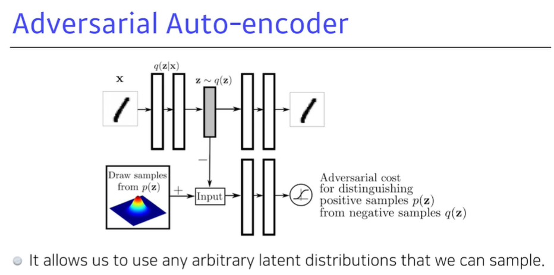
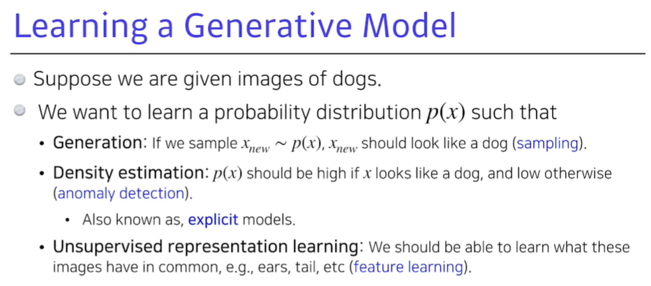

[toc]

# 210205

## 새로 배운내용

### 1.Conditional Independence

z가 주어졌을때, x와 y가 독립이라면 p(x|y, z) = p(x|z)이다.

(p(x,y|z) = p(x|z) * p(y|z) 이고

p(x|y, z) = p(x, y|z) / p(y|z) = p(x|z) 이다.)

Conditional Independence를 잘 활용해 적절한 parameter의 수를 찾아내는 것이 핵심이다.

### 2.Auto-regressive Model

Auto-regressive Model은 하나의 정보가 이전 정보들에 dependent한 것을 뜻한다.

어떻게 순서를 매길지, 몇개의 이전 정보들에 dependent하게 할지,

이미지의 경우 어떤 정보들에 dependent하게 생각할지 등에 따라 모델이 달라진다.

### 3.NADE

xi 가 x1 ... xi-1에 dependent한 모델이다.

일반적으로 Density Estimator라는 말이 있으면 explicit model을 말할 때가 많다.

반대로 implicit model은 어떤 사진에 대한 판별은 하지 못하고 생성만 하는 것을 말할 때가 많다.

### 4.Pixel RNN

pixel의 ordering에 따라 Row LSTM, Diagonal BiLSTM으로 나뉜다.

### 5.Variational Auto-encoder(VAE)

궁극적으로 하려는것은 x를 잘 표현할 수 있는 z라는 latent space를 찾고 싶음.(encoder)

Posterior distribution을 계산하기가 어려워서 이것을 잘 근사할 수 있는

Variational distribution을 찾는것을 Variational inference라고 한다.

Posterior distribution과 MLE를 헷갈리지 말자. x와 z가 반대다.

그런데 p를 모르는데 어떻게 q를 찾지??

아래 수식에서 x와 z의 KL divergence를 줄이고 싶은것이므로 ELBO에 해당하는 식을 늘리면 된다.(evidence lower bound)

ELBO를 계산해보면

Reconstruction Term과 Prior Fitting Term으로 나뉜다.

Reconstruction Term은 Auto-encoder에서 reconstruction loss term이고,

Prior Fitting Term은 latent prior fitting term이다.

좀 더 자세히는 x 를 z로 보냈다가 다시 x로 돌아왔을때의 loss를 줄이는 것이 Reconstruction Term,

x를 z로 보냈을때 z에서의 분포가 사전에 가정한 분포와 얼마나 같은지를 측정하는 것이 Prior Fitting Term이다.

Variational Auto-encoder는 입력 x가 주어지면 latent space z로 보내서 무언가를 찾고 reconstruction 하는데

generative model이 되기 위해서는 latent space z에서 샘플링하고, decoder를 통해서 나오는 출력이 있어야한다.

Variational이 아닌 단순 Auto-encoder는 input이 z로 갔다가 decoder를 통해서 다시 나오는 것 뿐이므로 generative model이 아니다.

#### limitaion

explicit model이 아니다.

KL divergence 가 미분가능해야 하는데 이를 만족하는 확률분포가 몇개 없고,

Gaussian distribution 를 사용했을때는 미분가능하므로 대부분 Gaussian distribution을 사용한다.

isotropic Gaussian은 모든 output dimension이 independent한 것을 얘기한다.

### 6.Adversarial Auto-Encoder(AAE)

wasserstein auto-encoder(WAE)의 한 종류로 wasserstein distance를 줄여주는 것과 동일한 효과가 있다.

wasserstein distance란? 아래링크 참조

https://www.slideshare.net/ssuser7e10e4/wasserstein-gan-i 

gan을 활용해서 latent space사이의 분포를 맞춰주는 방법

VA와 Prior Fitting Term만 다름.

VA에서 gaussian distribution을 사용하고 싶지 않을때 사용할 수 있다.

sampling이 가능한 분포면 어떤 분포든 사용할 수 있다.

### 7.GAN

implicit model이다

generator가 고정돼있을때 discriminator 입장에서만 보면 최적해가 다음과 같이 나온다.

위에서 구한 식을 generator의 식에서 대입해보면 다음과 같이 계산된다.

이것은 gan의 objective가 Pdata와 Pg 사이의 Jenson-Shannon Divergence를 최소화 하는 것을 의미한다.

이론적으로는 맞는 말이지만, 실제로는 discriminator 가 optimal에 수렴한다고 보장할 수 없다.

동일한 논리가 AAE를 WAE로 해석할때 활용된다.

#### DCGAN

처음의 GAN은 MLP로 만들어 졌는데, GAN을 이미지 도메인에 적용한 것이 DCGAN이다.

여러가지 좋은 테크닉을 발견했다.

leaky relu를 쓰자, 이미지에서는 MLP보다 deconvolution layer를 사용하는것이 좋다 등

#### Info-GAN

단순히 이미지를 생성하는 것이 아니라 class를 random하게 넣는다[궁금한 점](#1.info-gan에서-class를-랜덤하게-넣어주는데-어떻게-학습이-되지?)

이것은 gan이 특정 mode에 집중할 수 있게 도와준다.

#### Text2Image

#### CycleGAN

Cycle-consistency loss를 활용해 도메인을 바꾼다.

이것을 이용해서 데이터셋을 짝을 이루어주지 않아도 학습할 수 있다.

#### Star-GAN

mode를 정해줄 수 있다.

이미지를 단순히 도메인을 바꾸는 것이아니라 control할 수 있다.

#### Progressive-GAN

처음부터 고해상도 이미지를 학습하는 것 보다는

저해상도에서부터 고해상도로 점점 늘려가며 학습을 진행해서

고해상도의 이미지를 만들 수 있었다.

## 참고용

### 1.Generative Model

강아지 사진을 생성만 하는 것이 아니라, 어떤 사진이 강아지사진인지 판별할 수 있어야하고,

강아지의 특징을 찾아낼 수 있어야 한다.

판별할 수 있는 모델을 explicit model이라 한다.

### 2.베르누이 분포, 카테고리컬 분포

## 궁금한 점

### 1.Info-GAN에서 class를 랜덤하게 넣어주는데 어떻게 학습이 되지?

[돌아가기](#info-gan)

각 x의 class를 랜덤하게 넣는것이 아니다.

http://jaejunyoo.blogspot.com/2017/03/infogan-1.html