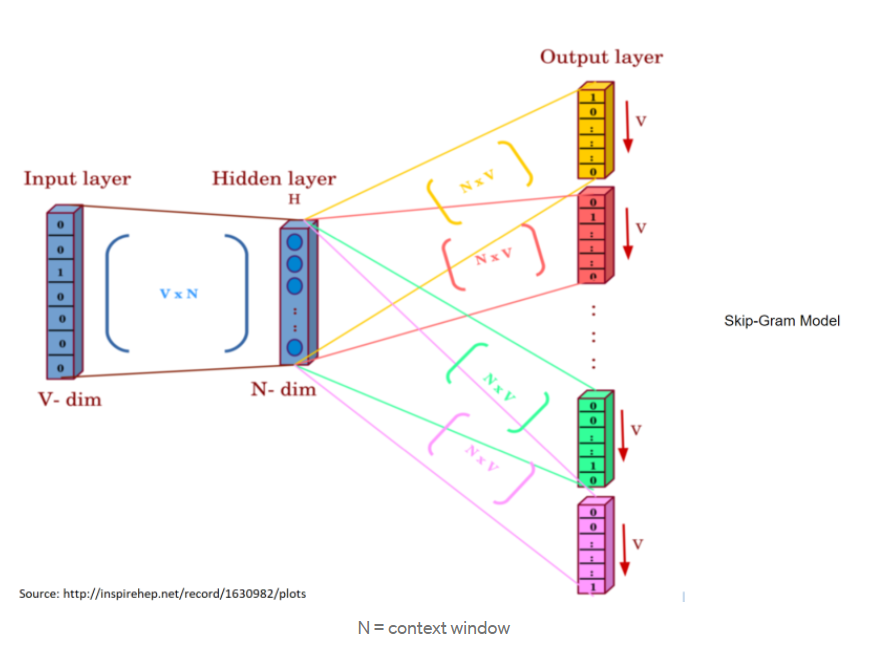

[toc]

# 210215

## 새로 배운내용

자연어를 다루는 분야에는 NLP, Text mining, Information retrieval등이 있다.

### 1.NLP

#### Low-level

Tokenization은 문장을 의미별로 분해하는 것이다.

단어별로 분리하는 것이 아니기 때문에 어떤 Tokenizer를 쓰는지에 따라 다른 Token들이 생긴다.

Stemming은 어미를 없애고 단어의 어근을 추출하는 것이다.

#### Word and phrase level

##### Named entity recognition

New York Times 를 각각의 단어로 인식하는 것이 아니라 하나의 고유명사로 인식해야한다.

POS는 문장내에서 단어의 품사를 구별하는 task이다.

#### Sentence level

문장이 긍정, 부정을 나타내는지 판별하거나 기계번역등이 포함된다.

#### Multi-sentence and paragraph level

##### Entailment prediction

문장간의 논리적인 내포나 모순을 예측하는 task

##### question answering

독해기반의 질의응답

질의의 키워드가 포함된 문서에서 독해를 통해 정답을 추출한다.

##### dialog systems

챗봇과 같이 대화를 수행할 수 있는 시스템

##### summarization

문서를 요약하는 task

### 2.Text mining

빅데이터 분석과 관련된 경우가 많이 있다.

ex)과거 1년동안 나온 모든 뉴스를 모아서 키워드를 추출하여 분석하는 경우

빅데이터 분석에 기반한 사회과학(Computational Social-Science)와도 깊은 관계가 있다.

### 3.Information retrieval(정보검색)

네이버나 구글 등에서 사용되는 검색기술을 연구하는 분야

현재 검색기술은 꽤 많이 발전한 상황이라 연구가 활발하지는 않음

세부분야로 추천시스템이 있다.

### 4.Word2Vec 적용분야

### 5.GloVe

다른데서 본거랑 달리 bias term이 없다.

## 참고용

### 1.Bag-of-Words

원핫인코딩을 한다.

어떤 단어쌍이든 유클리드거리가 루트2 이고, 코사인 유사도가 0이다.

단어의 순서를 고려할 수 없다.

### 2.NaiveBayes Classifier

문서를 정해진 카테고리, 클래스로 분류하는 기법

처음 보는 단어가 등장했을경우 p(w|c) = 0이기 때문에 해당 클래스로 분류할 수 없게 된다.

이러한 문제점을 해결하기 위해 regularization이 추가되기도 한다.

### 3.Word Embedding

비슷한 의미를 가지는 단어가 비슷한 위치에 맵핑한다. [궁금한점](#1.word-embedding이-어떻게-비슷한-단어를-비슷한-위치로-맵핑할-수-있을까?)

- [Word2Vec, NeurIPS'13](https://arxiv.org/abs/1310.4546)
- [GloVe, EMNLP'14](https://www.aclweb.org/anthology/D14-1162/)

## 궁금한 점

### 1.Word Embedding이 어떻게 비슷한 단어를 비슷한 위치로 맵핑할 수 있을까?

[돌아가기](#3.word-embedding)

비슷한 단어는 주변 단어가 나타날 확률이 비슷하므로 비슷한 벡터를 가진다

### 2.skip-gram에서 출력층 Weight

N x V 행렬이 다 같은건가?

