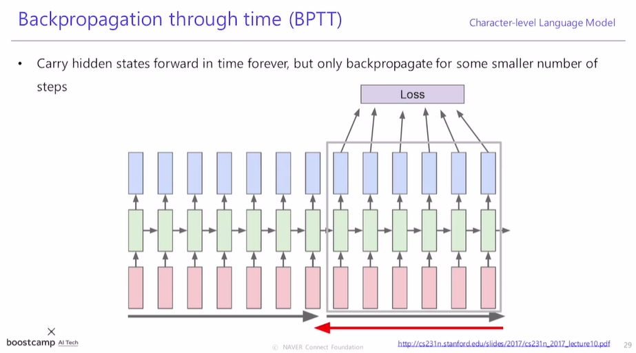
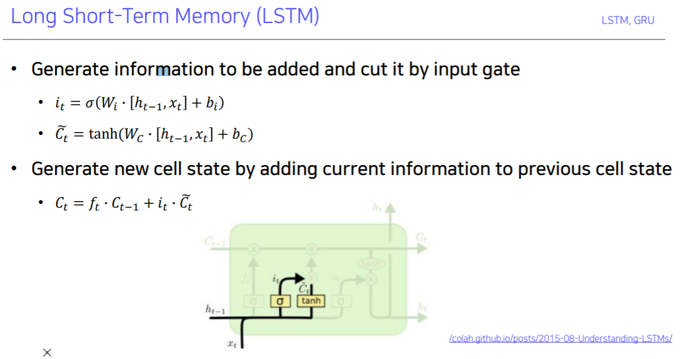

[toc]

# 210216

## 새로 배운내용

### 1.RNN 

#### Types of RNNs

##### One-to-one

보통의 신경망

##### one-to-many

제일 처음의 입력뿐만 아니라 time step마다 x를 입력해주어야 하므로 보통 0으로 채워진 입력을 넣는다.

ex)Image Captioning

##### many-to-one

ex) Sentimental Classification

##### many-to-many(sequence-to-sequence)

ex)machine translation

### 2.Chracter-level Language Model

RNN의 적용 예제

training

inference[궁금한 점](#1.RNN inference)

첫번째 입력값만 주고, 출력값을 다음 time step의 input으로 사용한다.

#### 예시

##### 소설

##### 대본

왼쪽이 학습데이터의 일부,, 오른쪽이 결과

##### 논문

왼쪽이 학습데이터의 일부, 오른쪽이 결과

##### 코드

### 3.Backpropergation through time (BPTT)

끝까지 읽은 후 학습하려면 시간이 너무 오래걸리기 때문에, 적절한 크기로 잘라서 학습한다.

hidden state의 어떤 정보가 어느 위치에 저장되는지 분석하는 방법이 있다.

(공백을 4번 생성해야하는데 지금까지 2번 생성했다 등의 정보를 기록해야 한다.)

역추적방법으로 hidden state의 한 값을 고정시키고 분석을 진행할 수 있다.

hidden state의 값을 추적해보면 아래와 같이 나오는데, 두번째 사진처럼 ""에 따라 정보가 바뀌는것을 알 수 있는 경우가 있다.

사실 위의 결과들은 Vanilla RNN이 아니라 더 발전된 모델을 사용한 것이다.

### 4.LSTM

cell state vector가 더 중요한 정보를 담고 있다.

#### i,f,o,g 의 역할

##### Forget gate

##### Gate gate

input gate와 함께 cell state vector를 업데이트하는 역할을 한다.

##### Output gate

cell state vector는 필요한 정보들을 기록하고 있고,

hidden state vector는 그 정보들 중에 지금 필요한 정보를 기록한다.

### 5.GRU

LSTM의 cell state vector 역할을

GRU에서 hidden state vector가 해준다.

LSTM은 입력이 3개(cell, hidden, input)인 반면 GRU는 2개(hidden, input)라서 속도가 빠르다.

LSTM에서 forget gate를 없애고, input gate의 값(z)을 1에서 뺀 값을 사용한다.(1-z)

### 6.LSTM, GRU Backpropagation

RNN에서는 같은 행렬 W가 계속해서 곱해지는 형태라서 gradient vanishing/exploding의 문제가 발생하지만

LSTM, GRU에서는 덧셈의 형태라서 RNN보다 더 오래 살아남아 멀리까지 정보를 전달할 수 있다.

### Summary

## 참고용

### 1.RNN notation

y는 매 time step에서 출력해야 하는 경우(단어의 품사 에측 등)도 있고,

마지막에 한번만 출력해야하는 경우(문장의 긍정 부정 등)도 있다.

## 궁금한 점

### 1.RNN inference

[돌아가기](#2.Chracter-level Language Model)

영어 한 글자만 첫번째 입력만 주는거면 26개(특수문자나 공백을 더한다해도 100개도 안됨)의 경우만 출력이 가능한건가?

같은 입력을 주고 다른 결과물을 받고싶을때는 어떻게 할 수 있을까?