[toc]

# 210217

## 새로 배운내용

### 1.seq2seq

RNN, LSTM, GRU를 사용하는 경우에 문장 앞부분의 정보가 유실될 가능성이 크다. 번역의 경우 앞부분을 잘못 해석하는경우 전체 문장이 잘못될 가능성이 매우 크다.

여기서 문장을 거꾸로 입력하는 아이디어도 있다.(home go I)

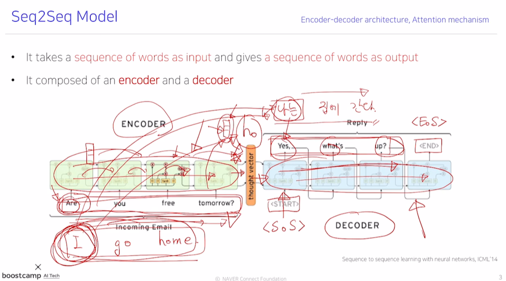

#### attention

이런 문제를 해결할 수 있는 구조가 attention이다.

decoder에서 input과 hidden vector를 계산한 후 이 벡터를 encoder에서 계산한 hidden vector들과 내적을 통해 가중치를 계산한다.

그리고 가중평균(attention output)과 함께 다음 단어를 예측한다.

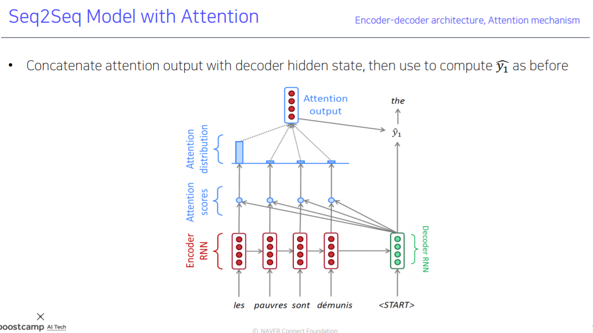

training단계에서 잘못 출력된 단어를 다음 입력으로 넣는것이 아니라 ground truth를 입력하는 것을 Teacher forcing이라 한다. 학습은 더 잘 진행되지만 실제 추론단계와는 다른 환경이기 때문에 둘을 적절히 섞어서 사용하는 방법도 있다.

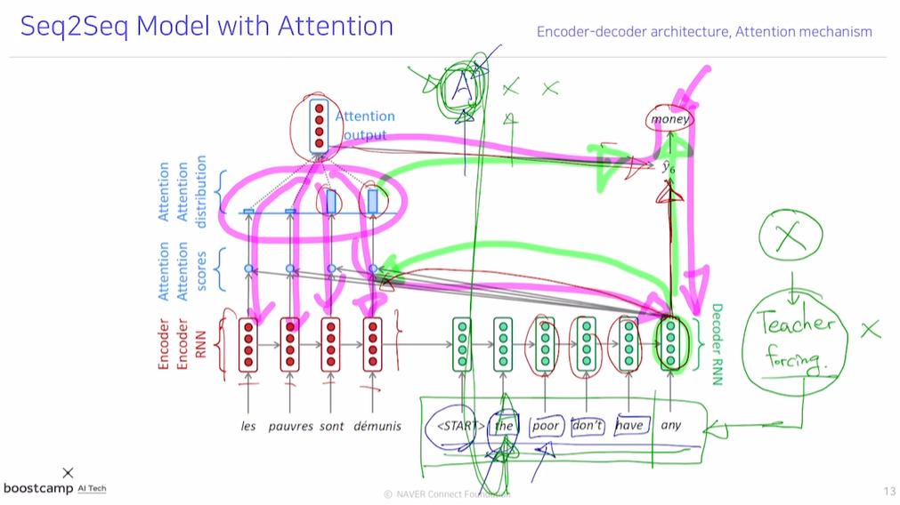

##### attention score

attention score를 구하는 방법이 내적만 있는것이 아니다.

아래 식에서 내적은 general한 경우의 W벡터가 항등행렬인것과 같다.

W벡터는 학습가능한 행렬로 취급할 수 있다.

concat방식은 2개의 층을 쌓은것이다.(W, v)

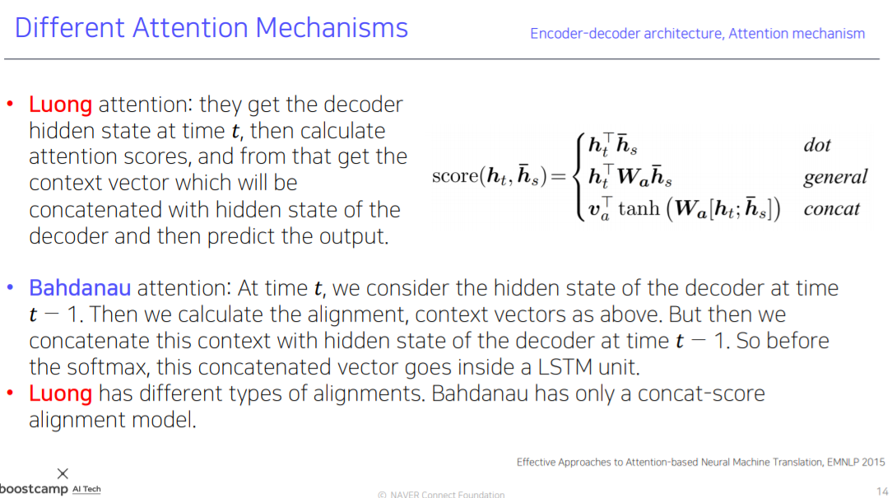

##### summarize

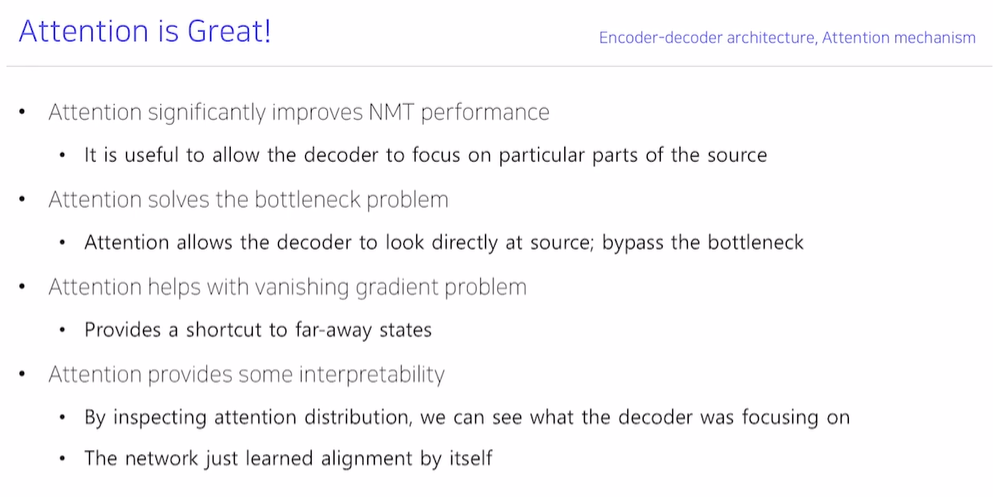

### 2.Beam Search

attention 구조를 가진다 하더라도 Greedy decoding 문제를 겪는다.

중간에 한 단어가 잘못 생성되면 다시 돌아갈 수 없다.

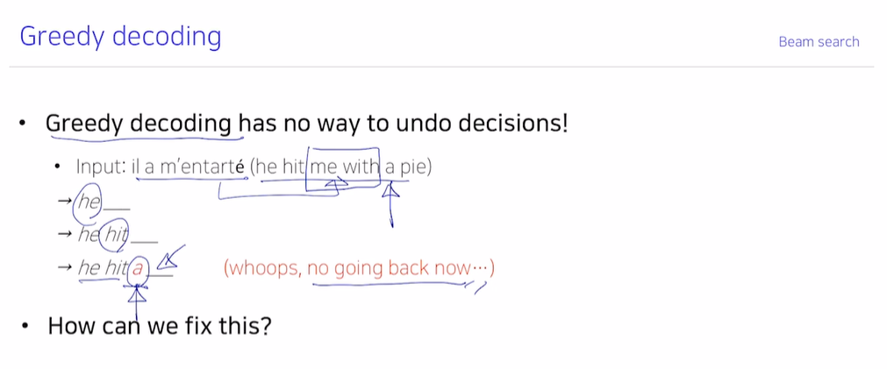

P(y|x)를 최대화 하는것은 각각의  P(y1|x), P(y2|y1, x) 등을 최대화 하는것으로 보장되지 않는다. 

모든 경우를 따져보기에는 |V|^t 만큼의 계산을 해보아야 하므로 불가능하다.

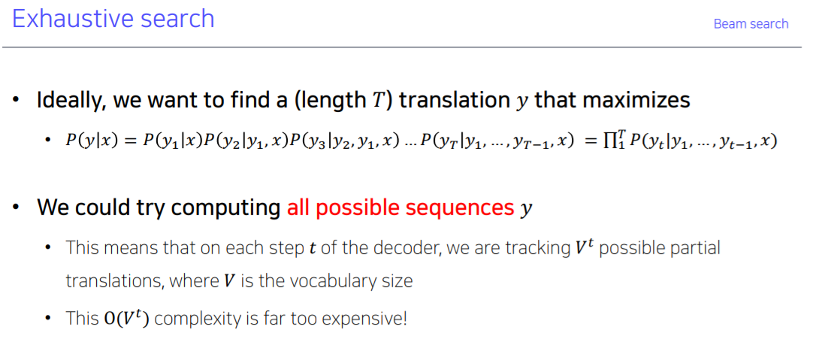

Beam Search는 모든 경우를 다 따져보는것은 아니지만 k개의 가능한 단어들을 살펴보며 가장 큰 확률을 가지는 y를 선택한다. (k^t가 아니라 매 step마다 k개의 경우만 남긴다.)

계산의 편의를 위해 확률값에 로그를 취한다.

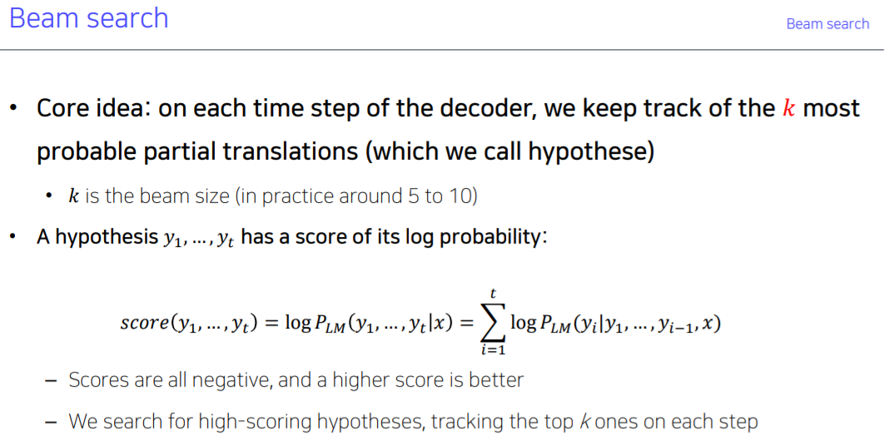

Beam Search의 경우 <EOS> 토큰이 서로 다른 시점에 나오므로 언제 Stop할지 정해야한다.

<EOS> 토큰이 나오면 임시 저장공간에 저장을 해둔다.

time T를 정해두고 T스텝까지만 진행하고 중단하는 방법이 있고,

임시 저장공간의 크기를 정해두고 저장공간이 꽉 차면 중단하는 방법이 있다.

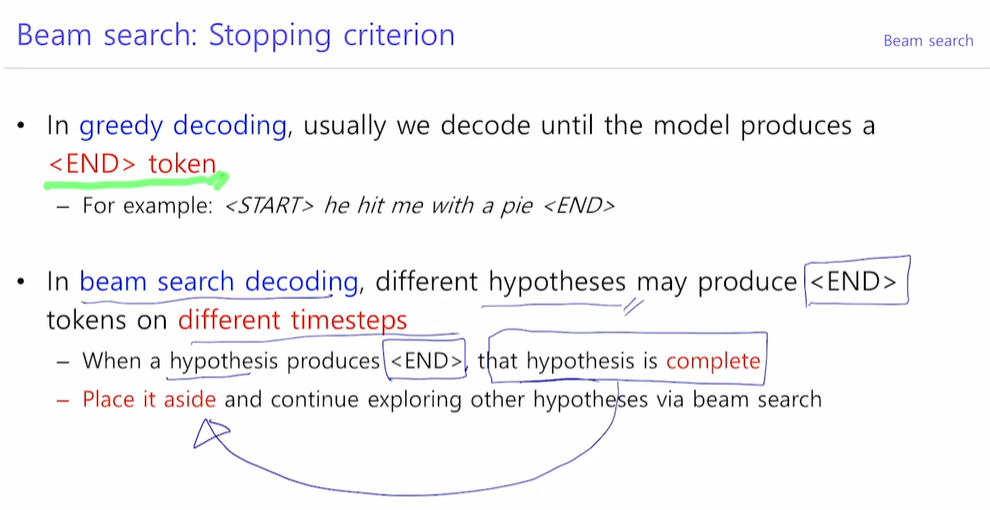

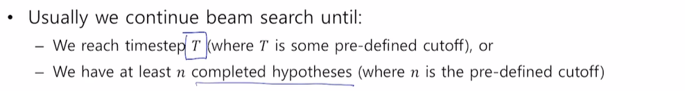

그런데 단순히 log확률 값이 가능 큰 y를 출력하면 길이가 짧은 문장들이 나올 확률이 높기때문에 문장의 길이로 나누어주는 normalize를 한다.

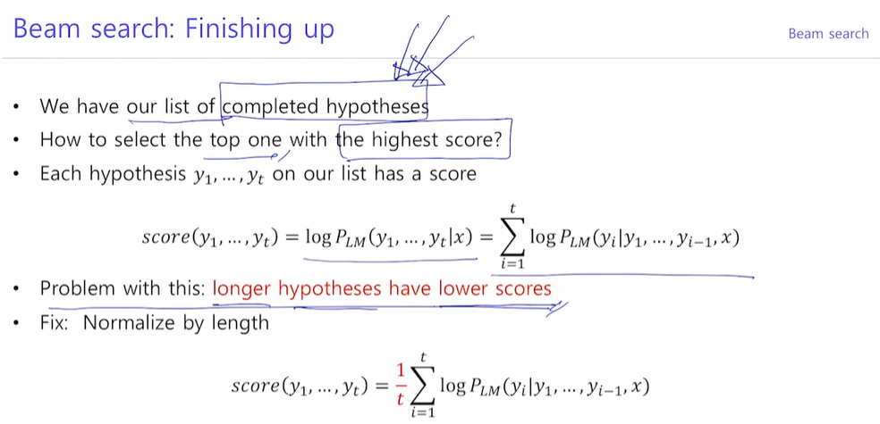

### 3.BLEU score

output의 정확도를 평가하는 방법이다.

단순히 time step별로 단어를 맞췄는지만 평가하게 되면 단어가 한칸씩 밀리거나 한 단어만 빼먹은 경우라도 정확도가 0%가 될수있다.

정밀도는 (맞춘 단어의 수) / (예측한 문장의 길이)

재현율은 (맞춘 단어의 수) / (reference 문장의 길이)

F-measure 는 정밀도와 재현율의 조화평균이다.

그런데 이 방법은 단어의 순서와 상관이 없다.

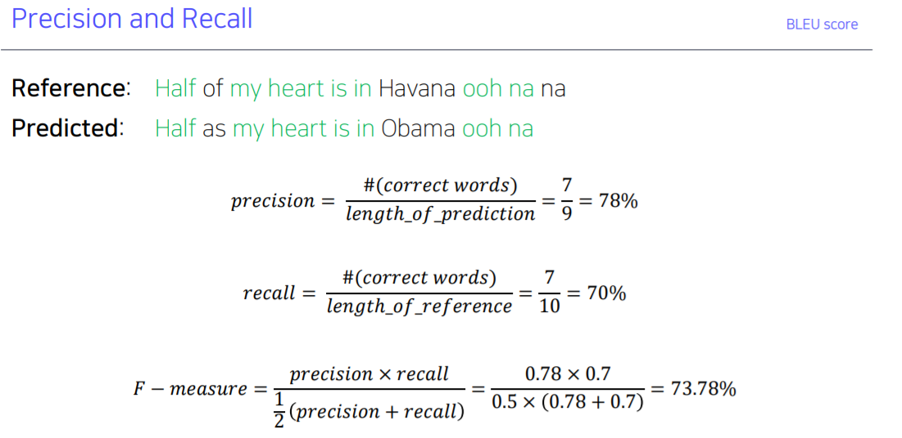

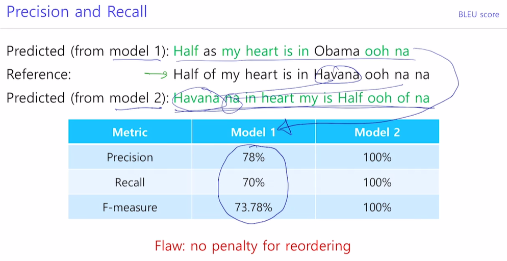

순서를 반영하지 못하는 방법을 개선한 것이 BLEU score이다

N-gram 단위로 존재하는지를 측정한다. (N = 1,2,3,4)

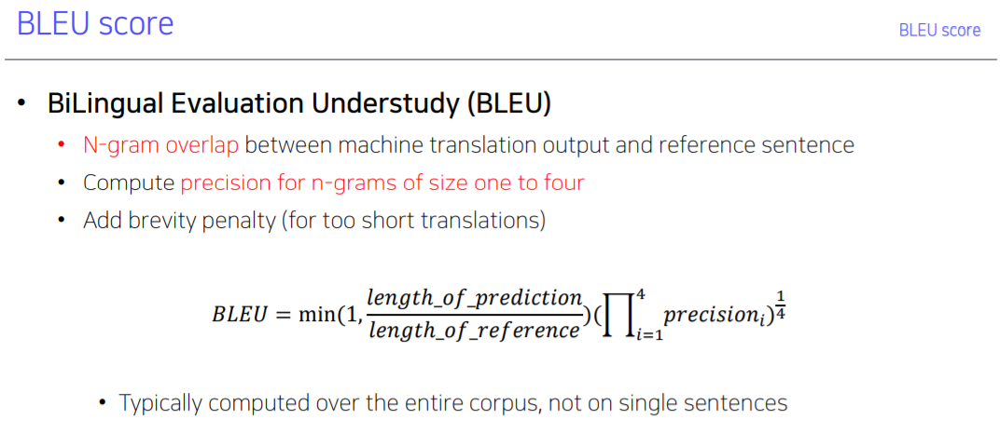

## 참고용

## 궁금한 점

