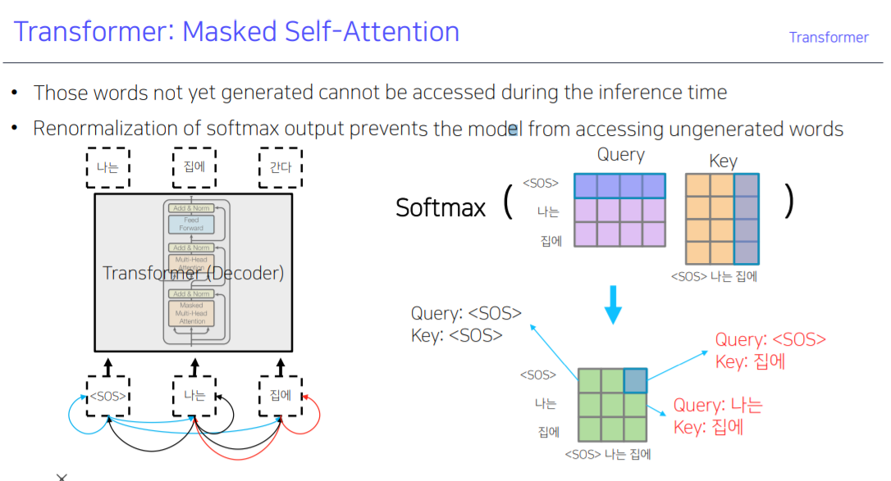

[toc]

# 210218

## 새로 배운내용

### 1.Attention

attention을 RNN, LSTM, GRU의 add-on module이 아니라

attention만을 이용해 대체하였다.

RNN에서 Decoder에서 hidden state vector를 attention scores와 내적한 것과 비슷한데,

Transformer에서는 input vector를 그대로 사용한다.

input vector 끼리 내적을 통해 attention scores를 계산하는데 이 방법은 자기 자신과의 내적값이 크게 나올 확률이 높으므로

각 input vector를 Query, Key, value 벡터로 변환하는 Linear layer를 두고

Query vector와 Key vector를 내적하는 방법으로 해결한다.

행렬연산으로 바꾸고 GPU를 통해서 빠르게 계산할 수 있다.

그런데 Q, K matrix 각각의 변수를 평균이 0 분산이 1인 독립변수라고 했을때 차원이 커질수록 Q * K.T의 분산이 차원에 비례하게 된다.

따라서 Q의 차원의 루트값으로 나눠주어 표준편차를 1로 만들어준다.

표준편차가 크면  softmax함수가 큰 값이 너무 치중해서 학습이 잘 안된다.

#### Multi-Head Attention

위와 같은 attention을 여러개 만들어서 concat해서 encoding vector를 만든다.

각 단어에 대해서 다른 측면에서의 정보를 얻어내야 할 수 있기 때문에 사용한다.

I went to the school

I came back home

I took a rest

이라는 문장에서 I 라는 단어에 대해서 행동에 대한 정보를 뽑아낼 수도 있고, 장소에 대한 정보를 뽑아낼 수도 있다.

Add & norm에서

Add는 residual connection을 뜻한다.

encoding vector에 input vector를 그대로 더해주어서 최종 encoding vector를 만든다는 뜻. encoding vector와 input vector의 차원이 같아야함.

ex) input vecotr = (1, -4)일때 encoding 결과가 (2, 3)이면 최종 encoding vector = (3, -1)이 된다.

norm은 layer normalization을 뜻한다.

### 2.normalization

#### batch normalization

forward propagation 과정에서 각 node 의 출력값을 normalization 한다.

아래 그림은 batch size가 3인 경우에 한 노드에서 출력값이 3, 5, -2가 나온 경우이다.

#### layer normalization

각 input vector를 normalization 한다.

affine transformation은 각 특성별로 적용해준다.

### 3.Positional Encoding

위의 방법만 사용하는 경우 단어의 순서를 고려하지 못하는 문제점이 있다.

순서정보를 고려해주기 위해 순서에 따라 각기 다른 벡터를 더해준다.

### 4.Warm-up Learning Rate Scheduler

### 5.High-Level View

N은 같은 과정을 몇번 반복하는지를 나타낸다. 6, 12, 24 등의 값을 사용함

### 6.Decoder

decoder에서는 query vector를 만들어내고

key, value vector는 encoder에서 받아서 사용한다.

#### Masked Self-Attention

I go home을 나는 집에 간다 로 번역하는 경우에

<SOS>  <나는> < 집에> 를 Decoder의 입력벡터로 넣지만,

<SOS>를 입력할 당시에는 <나는>과 <집에> 에 대한 정보는 없으므로

softmax를 통과한 값을 후처리 해준다.

## 참고용

- [Attention is all you need, NeurIPS'17](https://arxiv.org/abs/1706.03762)
- [Illustrated Transformer](http://jalammar.github.io/illustrated-transformer/)

- [Attention is all you need, NeurIPS'17](https://arxiv.org/abs/1706.03762)
- [Illustrated Transformer](http://jalammar.github.io/illustrated-transformer/)
- [Annotated Transformer](http://nlp.seas.harvard.edu/2018/04/03/attention.html)
- [Group Normalization](https://openaccess.thecvf.com/content_ECCV_2018/papers/Yuxin_Wu_Group_Normalization_ECCV_2018_paper.pdf)

## 궁금한 점

