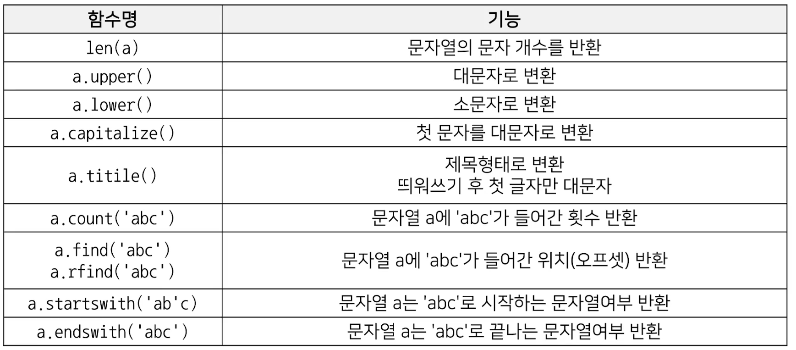
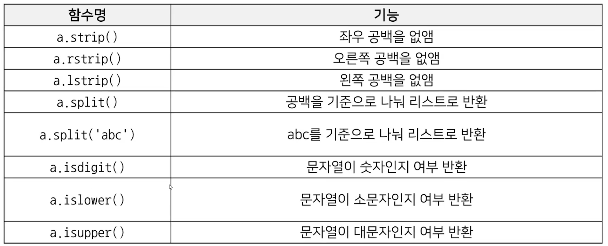
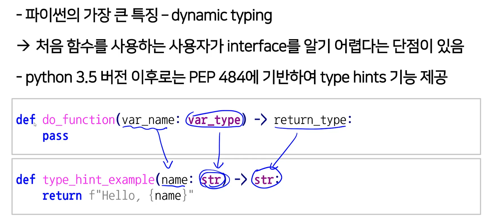
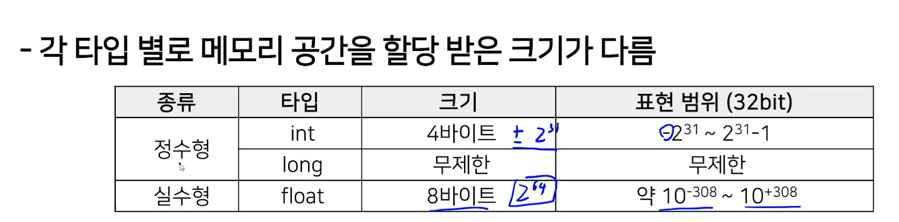

[toc]

# 210119

## String 객체의 메소드들

함수를 작성할 때 type hint라는 것을 사용할 수 있다.

## 궁금한 점

2 ^ 64은 크게 잡아봤자 10^20보다 작은데 float형은 64비트로 어떻게 10 ^ 308까지 표현할 수 있을까?

float형은 비트를 나누어서 지수를 표현하는 자리, 숫자를 표현하는 자리로 표기한다고 한다.

예를들어 지수를 표현하는 자리에서 30을 표기하고

숫자를 표현하는 자리에서 40을 표기하면

40 * (2 ^ 30)을 뜻한다고 함

그러면 약 10 ^ 308을 표현하려면 지수비트가 몇비트를 차지해야 할까?

지수 비트로 n 비트를 사용한다면

2 ^ (2 ^ n - 1)만큼 표현 할 수 있으므로 2 ^ (2 ^ n - 1)이 10 ^ 308과 가까워지는 n을 찾으면 될거 같다.

양변에 상용로그를 취하면 (2 ^ n - 1 * 0.301 = 308 이고

2 ^ n = 1023이니까 n = 10이라고 볼수 있겠다.