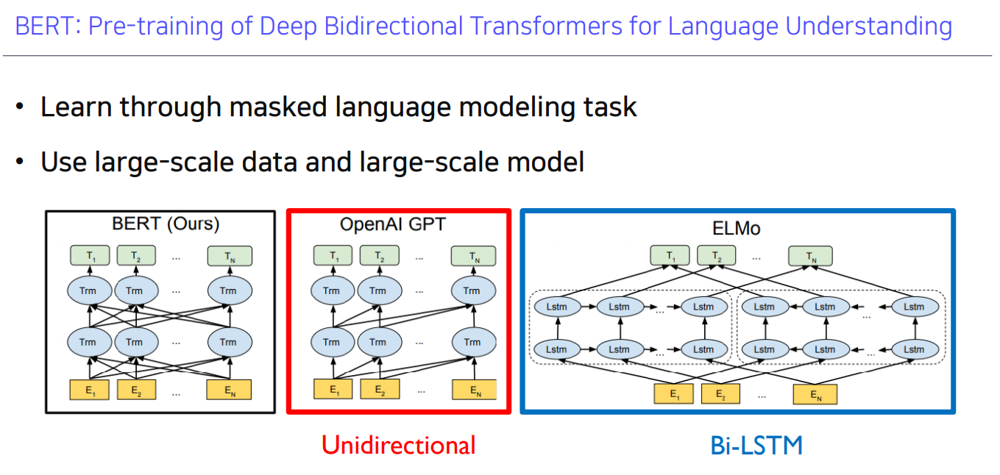
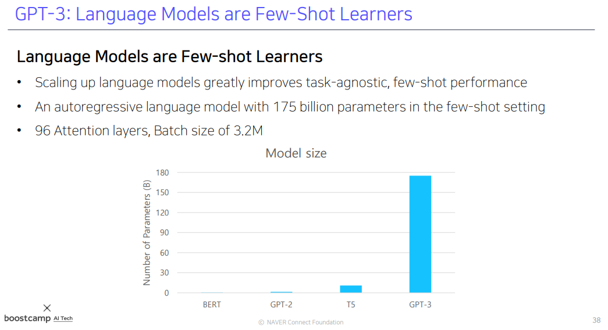
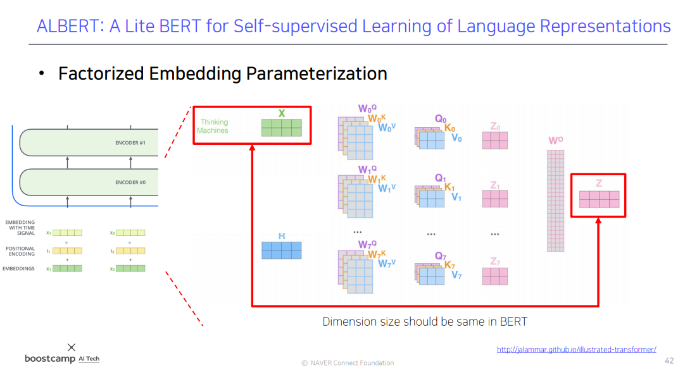

[toc]

# 210219

## 새로 배운내용

### Self-supervised Pre-training Models

정답레이블없이 (문장이 있으면 문장내에 답이 있으니까 따로 정답레이블을 만들지 않아도 되는 점에서) 학습하고 이러한 모델을 특정한 task에 사용할때는 fine tunning을 해서 사용한다.

#### GPT-1

special token을 통해 다양한 task를 처리할 수 있는 통합된 모델을 제안했다.

Classification

Extract token의 인코딩 벡터를 Output layer에 입력해 예측한다.

Entailment

문장을 구별하기 위해 Delimeter token을 추가하고

Extract token의 인코딩 벡터를  Output layer에 입력해 예측한다.

fine tunning을 할때는 output layer를 떼어내고

encoding vector만을 받아서 사용하기 위해 추가적인 레이어를 붙여서 학습시킨다.

이때 transformer layer는 학습율을 낮게잡아서 큰 변화가 일어나지 않도록 한다.

#### BERT

현재까지도 다양한 변형으로 널리 사용된다.

GPT과 마찬가지로 language modeling task의 일부로 문장의 단어를 맞추는 방법으로 학습했다.

##### Masked Language Model (MLM)

모르는 단어가 있거나 단어를 예측할때 뒤 쪽의 단어들도 함께 참고한다.

문장에서 단어의 일부(15%)를 MASK라는 토큰으로 바꾸고 해당 단어를 맞추는 방법으로 학습한다.

실제 추론상황에서는 MASK라는 토큰이 등장하지 않으므로, 80%는 MASK, 10%는 다른단어, 10% 그대로 놔두고 예측을 수행한다.

##### Next Sentence Prediction

하나의 글에서 두 문장을 뽑아서 SEP 토큰으로 구분한 다음, 두 문장의 순서가 이어지는 문장인지를 예측한다.

두 문장이 같은 서로 관련이 없는 Document에서 뽑힌 문장인지도 판별한다.

##### cf) ELMo

마찬가지로 학습을 하지만 LSTM을 사용해서 학습했다.

##### Summary

모델의 구조는 self-attention 블럭을 그대로 사용했다.

###### WordPiece embedding

입력 시퀀스를 단어별로 embedding을 한것이 아니라 subword 단위로 embedding을 했다.

###### Learned positional embedding

positional embedding 또한 임의로 정한것이 아니라 학습을 통해 사용했다.

###### Segment Embedding

문장 두개를 입력하는 경우 두 문장이 SEP 토큰으로 구별되기 때문에 서로 다른 문장이라는 것을 vector화 하기위해 추가한다.

##### Fine tunning

문장을 분석할때는 CLS 토큰의 인코딩 벡터를 Output vector로 사용하고,

단어를 분석할때는 각 단어의 인코딩 벡터를 Output vector로 사용한다.

##### Machine Reading Comprehension (MRC), Question Answering

Document에서 정답이 나오는 구간을 학습한다.

###### SQuAD 1.1

각 단어의 인코딩 벡터를 하나의 스칼라값으로 mapping하는 FC layer를 만들고,

이렇게 나온 스칼라값들을 softmax 함수를 통과시켜서 정답이 있는 곳을 찾을 수 있도록 학습하게 된다.

###### SQuAD 2.0

지문에 답이 없는 경우도 데이터셋에 포함돼있다.

CLS 토큰을 통해 답이 있는지 없는지를 먼저 판단하고, 답이 있다고 판단할 경우 

SQuAD 1.1과 같은 과정을 거친다.

###### SWAG

다음으로 이어질 문장을 예측한다.

문장을 하나씩 붙여서 CLS 토큰의 인코딩 벡터를 구하고 마찬가지로 스칼라값으로 mapping 한다.

모든 문장의 스칼라값들을 softmax함수를 통과시켜 정답을 학습할 수 있게 한다.

### Advanced Self-supervised Pre-training Models

#### GPT-2

GPT-1에서 크기만 키웠다고 보면된다.

학습또한 다음 단어를 예측하는 Language Modeling을 사용했다.

모델의 크기를 키우고, 데이터셋을 늘렸다. 데이터셋의 질을 높였다.

##### Motivation (decaNLP)

문장의 긍정, 부정을 판단하는 task나 문장을 이어서 생성하는 task 등은 기존에는 모델의 구조가 아예 달랐다.

decaNLP에서는 모든 자연어처리 task가 질의응답을 통한 자연어 생성 task로 환원될 수 있다는 것을 보였다.

##### Dataset

Reddit에서 3 karma(up-vote) 이상 받은 글의 외부링크 등과 같이 질이 좋을것 같은 글들을 Dataset으로 만들었다.

Preprocess로는 Byte Pair Encoding을 사용했다.

##### Model

transformer 블럭에서 위쪽에 있는 layer의 초기화 값을 줄여주었다.

##### Question Answering

CoQA라는 데이터셋을 이용해서 테스트했는데

fine tunning을 하기 전에도 55 F1 score를 보여주었다.

fine tunning을 한 BERT는 89 F1 score이다.

##### Summarization

마지막에 TL;DR(Too long, didn't read) 이라는 단어를 넣어서 이 단어가 등장하면 앞에 있었던 문장들을 요약한다.

##### translation

불어로 번역하고 싶은 경우 in French 등의 단어를 붙이면 output이 불어로 생성된다.

#### GPT-3

GPT-2에 비해서 훨씬 많은 파라미터, 데이터셋을 사용했다.

별도의 fine tunning 과정이 없어도 굉장히 뛰어난 성능을 보인다.

Few-shot의 경우 fine tunning이 아니라 inference 과정에서 보여준 것이다.

모델의 파라미터수를 늘릴수록 성능이 올라간다. (모델이 클수록 동적인 적응능력이 뛰어나다)

#### ALBERT(A Lite BERT)

앞선 모델들은 모델이 크고 데이터가 많기때문에 메모리가 많이 필요하고, 학습시간도 오래걸린다.

ALBERT는 성능의 하락없이 모델의 사이즈를 줄이고, 학습시간을 줄일 수 있는 모델이다.

어텐션 구조에서 skip connection이 존재하기 때문에 인코딩벡터와 임베딩 벡터의 크기가 같아야 한다.

skip connection을 유지하면서 파라미터 수를 줄이기 위해 low rank matrix factorization을 사용했다.

##### Cross-layer Parameter Sharing

self-attention block을 여러층 쌓았을때 모든 block에서 parameter를 공유한다.

##### Sentence Order Prediction

BERT에서 사용한 [Next Sentence Prediction](#Next Sentence Prediction) 방식이 그다지 실효성이 없다는 후속 연구들이 있다.

같은 Document에서 연속적으로 등장하는 문장2개를 순서를 섞어서 주고, 제대로 된 순서인지 아닌지를 판별하는 task이다.

기존 방법에서는 다른 document에서 뽑힌 경우 내용이 겹치지 않을 확률이 높기때문에 비교적 쉬운 task이고 연속적인 문장인 경우에도 단어가 많이 겹치는지를 판단할 수 있기 때문에, 논리적인 흐름을 구분할 필요가 없다.

#### ELECTRA

단어를 복원해주는 Generator와 원래 단어에서 바뀌었는지를 구별해주는 Discriminator를 가진다.

Generator는 BERT와 같은 역할을 하고

Discriminator는 self-attention block을 쌓은 모델로 이진분류를 예측하는 모델이다.

GAN의 아이디어를 착안한 모델이다.

### 경량화 모델

비슷한 성능을 유지하면서 모델의 크기와 계산속도를 줄인 모델이다.

휴대폰 등의 소형 디바이스에서 전력소모를 줄이면서 빠르게 계산을 수행하고자 할때 사용할 수 있다.

#### DistillBERT

Teacher model과 student model이 있다.

student model이 경량화된 모델로서 Teacher model의 softmax를 통과한 결과를 따라하기 위해 학습한다.

#### TinyBERT

DistillBERT와 비슷하지만, 중간결과물도 비슷하게 내려고 학습한다.(self-attention의 Q, K, V, W 또는 hidden state vector 등)

경량화 모델이기 때문에 차원이 다를 수 있어서 학습가능한 FC layer를 두고 학습한다.

## 참고용

### Knowledge Graph

BERT가 언어의 어떤 부분을 이해하고 있는지에 대해 연구했는데, 문장에 나타난 단어들은 잘 이해했지만, 문장에 나타나지 않은 추가적인 정보(상식)는 활용하지 못하는 것으로 나타났다.

예를 들어 '꽃을 심기위해 땅을 팠다'와 '집을 짓기위해 땅을 팠다' 에서 똑같이 땅을 팠다이지만 어떤 도구를 사용했는지는 BERT는 알 수 없다.

- [GPT-1](https://openai.com/blog/language-unsupervised/)
- [BERT : Pre-training of deep bidirectional transformers for language understanding, NAACL’19](https://arxiv.org/abs/1810.04805)
- [SQuAD: Stanford Question Answering Dataset](https://rajpurkar.github.io/SQuAD-explorer/)
- [SWAG: A Large-scale Adversarial Dataset for Grounded Commonsense Inference](https://leaderboard.allenai.org/swag/submissions/public)

- [How to Build OpenAI’s GPT-2: “ The AI That Was Too Dangerous to Release”](https://blog.floydhub.com/gpt2/)
- [GPT-2](https://cdn.openai.com/better-language-models/language_models_are_unsupervised_multitask_learners.pdf)
- [Illustrated Transformer](http://jalammar.github.io/illustrated-transformer/)
- [ALBERT: A Lite BERT for Self-supervised Learning of Language Representations, ICLR’20](https://arxiv.org/abs/1909.11942)
- [ELECTRA: Pre-training Text Encoders as Discriminators Rather Than Generators, ICLR’20](https://arxiv.org/abs/2003.10555)
- [DistillBERT, a distilled version of BERT: smaller, faster, cheaper and lighter, NeurIPS Workshop'19](https://arxiv.org/abs/1910.01108)
- [TinyBERT: Distilling BERT for Natural Language Understanding, Findings of EMNLP’20](https://arxiv.org/abs/1909.10351)
- [ERNIE: Enhanced Language Representation with Informative Entities, ACL'19](https://arxiv.org/abs/1905.07129)
- [KagNet: Knowledge-Aware Graph Networks for Commonsense Reasoning, EMNLP'19](https://arxiv.org/abs/1909.02151)

## 궁금한 점

