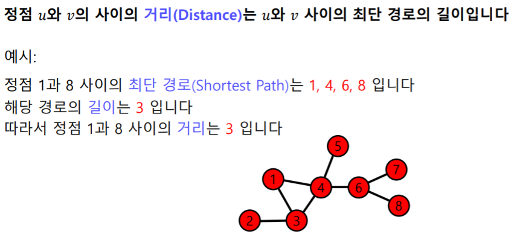
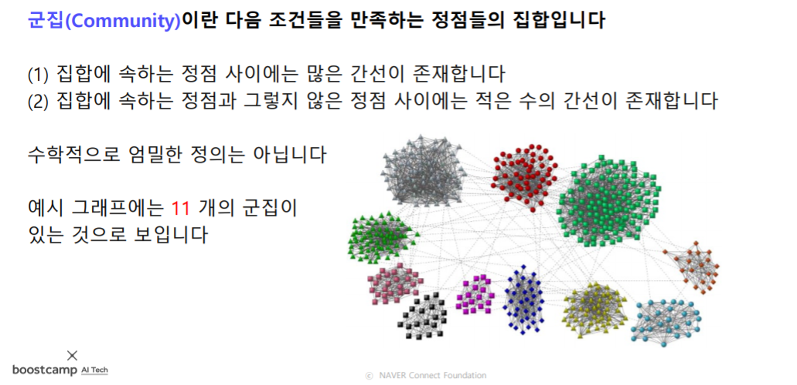
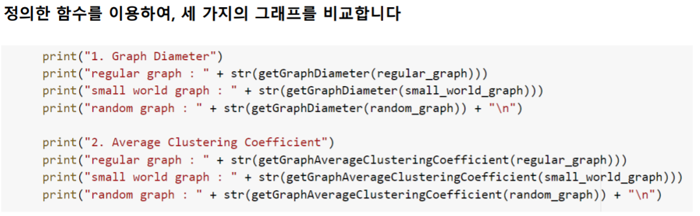

[toc]

# 210222

## 새로 배운내용

### 그래프

#### 그래프란 무엇이고 왜 중요할까?

##### 그래프란?

그래프는 정점집합과 간선집합으로 이루어져있다.

##### 그래프가 왜 중요할까?

우리 주변에는 많은 복잡계가 있고, 복잡계가 복잡한 이유는 구성요소간의 상호작용이 복잡하기 때문이다.

이런 복잡계를 그래프로 표현할 수 있다.

ex) 소셜 네트워크, 전자 상거래 구매 내역, 인터넷 등등

#### 그래프 관련 인공지능 문제예시

##### 정점 분류류(Node Classification) 문제

##### 연결 예측(Link Prediction) 문제

##### 추천(Recommendation) 문제

##### 군집 분석(Community Detection) 문제

##### 랭킹(Ranking) 및 정보 검색(Information Retrieval) 문제

##### 정보 전파(Information Cascading) 및 바이럴 마케팅(Viral Marketing) 문제

#### 그래프 관련 필수 기초 개념

##### 그래프의 유형 및 분류

###### 방향이 없는 그래프 vs 방향이 있는 그래프

###### 가중치가 없는 그래프 vs 가중치가 있는 그래프

###### 동종 그래프 vs 이종 그래프

##### 이웃(Neighbor)

#### (실습) 그래프의 표현 및 저장

NetworkX는 속도는 느리지만 사용이 편리하고

Snap.py는 속도는 빠르지만 사용이 조금 불편하다.

##### NetwokX 소개

##### 그래프의 표현 및 저장

###### 간선 리스트

###### 인접 리스트

###### 인접 행렬

###### NetworkX를 이용하여 저장하기

#### 1강 정리

### 그래프를 이용한 기계학습

#### 실제 그래프 vs 랜덤 그래프

#### 작은 세상 효과

##### 필수 개념: 경로, 거리 및 지름

###### 정점

###### 경로의 길이

###### 지름

##### 작은 세상 효과

#### 연결성의 두터운 꼬리 분포

##### 필수개념: 연결성

##### 연결성의 두터운 꼬리 분포

#### 거대 연결 요소

##### 필수 개념: 연결 요소

##### 거대 연결 요소

#### 군집 구조

##### 필수 개념: 군집 구조 및 군집 계수

###### 군집(Community)

###### 지역적 군집 계수(Local Clustering Coefficient)

###### 전역 군집 계수(Global Clustering Coefficient)

##### 높은 군집 계수

#### 실습: 군집 계수 및 지름 분석

##### 그래프 불러오기

##### 군집  계수 계산

##### 지름 계산

##### 비교 분석

#### 2강 정리

## 참고용

## 궁금한 점

