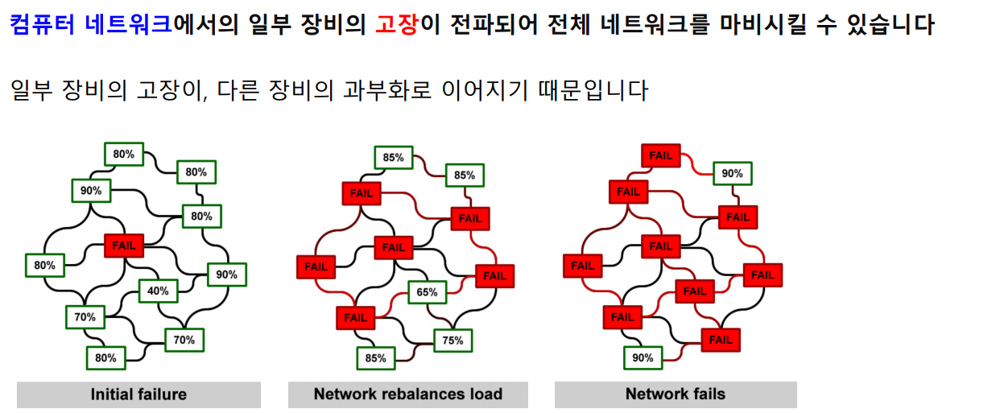

[toc]

# 210223

## 새로 배운내용

### 페이지랭크

#### 페이지랭크의 배경

##### 웹과 그래프

##### 구글 이전의 검색 엔진

#### 페이지랭크의 정의

##### 투표 관점

##### 임의 보행 관점

#### 페이지랭크의 계산

##### 반복곱

##### 문제점과 해결책

#### 실습: 나무 위키 검색 엔진

##### 나무위키 데이터 소개

##### 데이터 불러오기

##### 검색 1단계: 부분그래프 구성

##### 검색 2단계: 페이지랭크 점수 측정

#### 3강 정리

### 그래프를 이용한 기계 학습

#### 그래프를 통한 전파의 예시

##### 그래프를 통한 정보의 전파

##### 그래프를 통한 행동의 전파

##### 그래프를 통한 고장의 전파

##### 그래프를 통한 질병의 전파

#### 의사결정 기반의 전파 모형

##### 언제 의사결정 기반의 전파 모형을 사용할까?

##### 선형 임계치 모형

#### 확률적 전파 모형

##### 언제 확률적 전파 모형을 사용할까?

##### 독립적 전파 모형

#### 바이럴 마케팅과 전파 최대화 문제

##### 바이럴 마케팅이란?

##### 시드 집합의 중요성

##### 전파 최대화 문제

##### 정점 중심성 휴리스틱

##### 탐욕 알고리즘

#### 실습: 전파 모형 시뮬레이터 구현

##### 독립적 전파 모형 시뮬레이터

##### 선형 임계치 모형 시뮬레이터

#### 4강 정리

## 참고용

[Link Analysis](http://infolab.stanford.edu/~ullman/mmds/ch5.pdf)

[The PageRank Citation Ranking: Bringing Order to the Web](http://ilpubs.stanford.edu:8090/422/1/1999-66.pdf)

[A Survey on Influence Maximization in a Social Network](https://arxiv.org/abs/1808.05502)

## 궁금한 점

