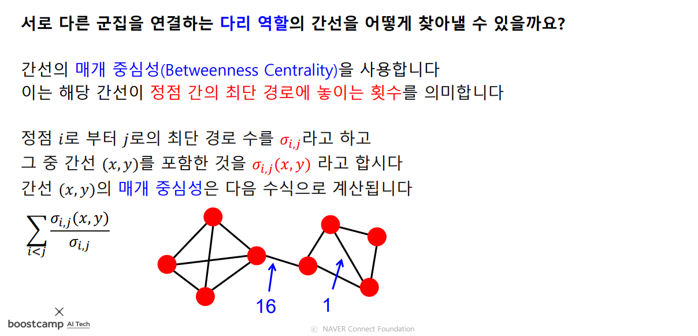
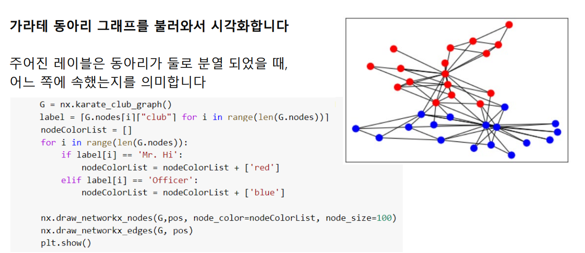
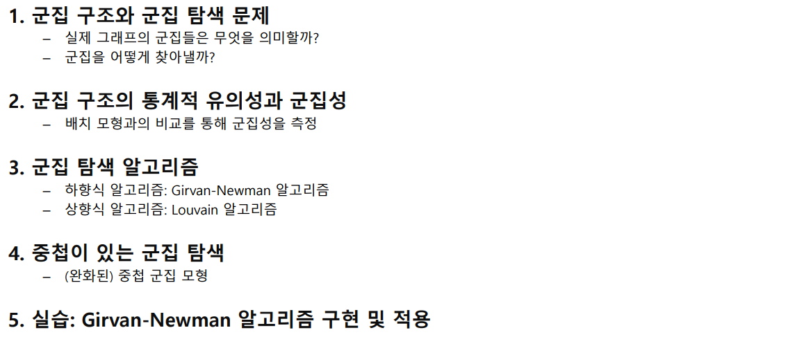
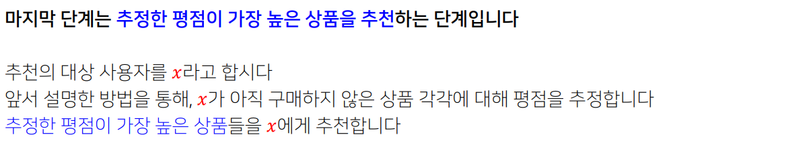
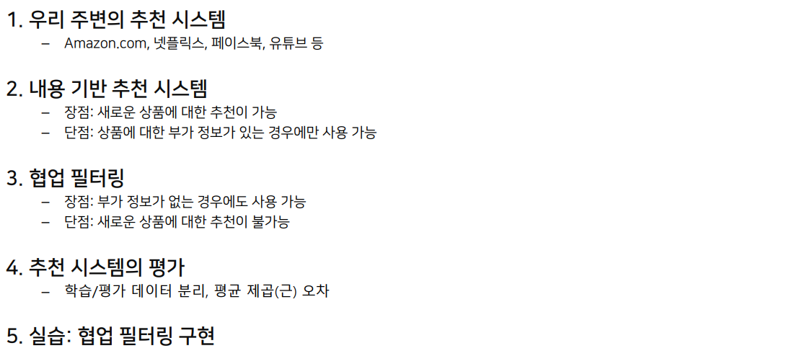

[toc]

# 210224

## 새로 배운내용

### 군집 탐색

#### 군집 구조와 군집 탐색 문제

##### 군집의 정의

##### 실제 그래프에서의 군집들

##### 군집 탐색 문제

군집 탐색 문제와 클러스터링 문제는 비슷하지만

군집 탐색은 정점들을 분류하고 클러스터링은 벡터들을 분류한다.

#### 군집 구조의 통계적 유의성과 군집성

##### 비교 대상: 배치 모형

##### 군집성의 정의

#### 군집 탐색 알고리즘

##### Girvan-Newman 알고리즘

##### Louvain 알고리즘

#### 중첩이 있는 군집 탐색

##### 중첩이 있는 군집 구조

##### 중첩 군집 모형

##### 완화된 중첨 군집 모형

집합논리가 퍼지논리로 대체된 것 같다.

#### 실습: Girvan-Newman 알고리즘 구현 및 적용

##### 실습용 데이터 불러오기

##### Girvan-Newman 알고리즘 구현

##### 가라테 동아리 내의 군집 분석

##### NetworkX 제공 군집 분석 알고리즘

#### 5강 정리

### 추천 시스템

#### 우리 주변의 추천 시스템

##### 아마존에서의 상품 추천

##### 넷플릭스에서의 영화 추천

##### 유튜브에서의 영상 추천

##### 페이스북에서의 친구 추천

##### 추천 시스템과 그래프

#### 내용 기반 추천시스템

##### 내용 기반 추천시스템의 원리

##### 내용 기반 추천시스템의 장단점

#### 협업 필터링

##### 협업 필터링의 원리

##### 협업 필터링의 장단점

#### 추천 시스템의 평가

##### 데이터 분리

##### 평가 지표

#### 실습: 협업 필터링 구현

##### 데이터 불러오기 및 전처리

##### 취향의 유사도 계산

##### 점수 추정

##### 정확도 평가

#### 6강 정리

## 참고용

## 궁금한 점

