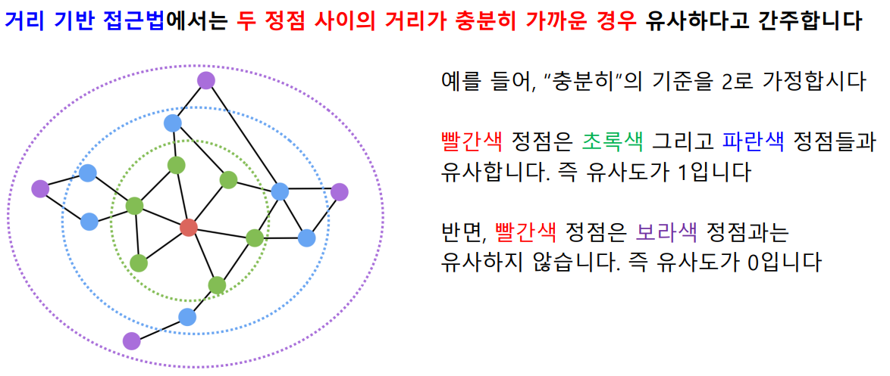
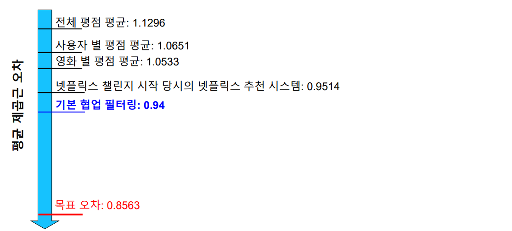
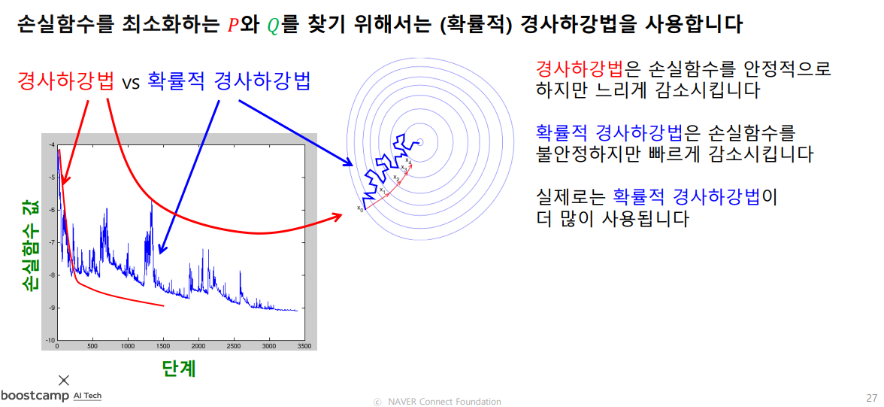

[toc]

# 210225

## 새로 배운내용

### 정점 표현

#### 정점 표현 학습

##### 정점 표현 학습이란?

##### 정점 표현 학습의 이유

##### 정점 표현 학습의 목표

#### 인접성 기반 접근법

##### 인접성 기반 접근법

##### 인접성 기반 접근법의 한계

#### 거리/경로/중첩 기반 접근법

##### 거리 기반 접근법

##### 경로 기반 접근법

##### 중첩 기반 접근법

dw는 d의 연결성이고, 연결성이 크면 가중치가 낮아진다.

#### 임의보행 기반 접근법

##### 임의보행 기반 접근법

##### DeepWalk와 Node2Vec

##### 손실 함수 근사

[궁금한점](#임의보행 기반 손실함수 근사는 어떻게 넘어간걸까?)

#### 변환식 정점 표현 학습의 한계

##### 변환식 정점 표현 학습과 귀납식 정점 표현 학습

##### 변환식 정점 표현 학습의 한계

#### 실습: Node2Vec을 사용한 군집 분석과 정점 분류

##### Node2Vec 수행

##### 군집 분석

##### 정점 분류

#### 7강 정리

### 추천시스템

#### 추천시스템 기본 복습

##### 추천시스템 예시

##### 추천시스템과 그래프

##### 내용 기반 추천시스템

##### 협업 필터링

##### 추천시스템의 평가

#### 넷플릭스 챌린지 소개

##### 넷플릭스 챌린지 데이터셋

##### 넷플릭스 챌린지 대회 소개

#### 기본 잠재 인수 모형

##### 잠재 인수 모형 개요

##### 손실 함수

##### 최적화

#### 고급 잠재 인수 모형

##### 사용자와 상품의 편향을 고려한 잠재 인수 모형

##### 시간에 따른 편향을 고려한 잠재 인수 모형

영화가 처음 나올때는 영화를 기다리던 사람들이 보기 때문에 평점이 높고, 시간이 지나면서 평점이 낮아진다.

그리고 긴 시간이 지나고 영화를 다시 찾는 사람은 영화에 대한 좋은 기억을 갖고 보는 것이기 때문에 평점이 올라간다.

#### 넷플릭스 챌린지의 결과

##### 앙상블 학습

##### 넷플릭스 챌린지의 우승팀

#### 실습: Surprise 라이브러리와 잠재 인수 모형의 활용

##### 데이터 불러오기 및 전처리

##### 잠재 인수 모형 학습

##### 점수 추정

##### 영화 추천

#### 8강 정리

## 참고용

[node2vec: Scalable Feature Learning for Networks](https://arxiv.org/pdf/1607.00653.pdf)

[DeepWalk: Online Learning of Social Representations](https://arxiv.org/pdf/1403.6652.pdf)

[Recommendation Systems](http://infolab.stanford.edu/~ullman/mmds/ch9.pdf)

[MATRIX FACTORIZATION TECHNIQUES FOR RECOMMENDER SYSTEMS](https://datajobs.com/data-science-repo/Recommender-Systems-[Netflix].pdf)

## 궁금한 점

### 임의보행 기반 손실함수 근사는 어떻게 넘어간걸까?

[돌아가기](#손실 함수 근사)

이 과정에서 exp값이 작다면 +1을 해주는 가정이 유효하지 못할것 같고

exp값이 크다면 분모에있는 합연산이 곱연산으로 바뀌는 가정이 유효하지 못한것 같다.

내 유도과정이 틀렸나?