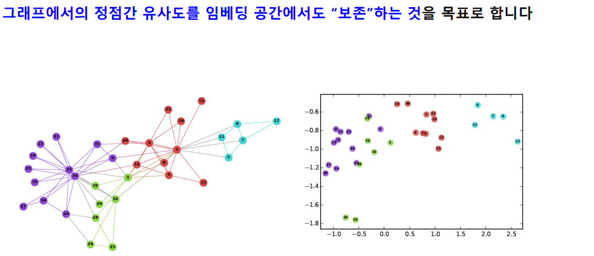
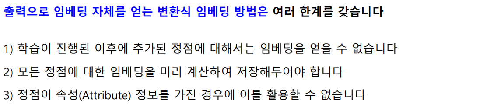
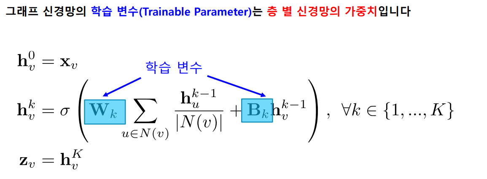
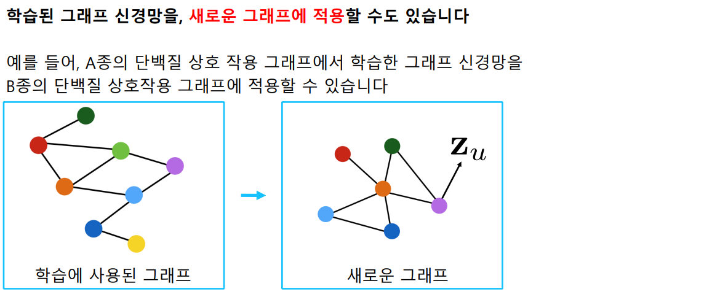
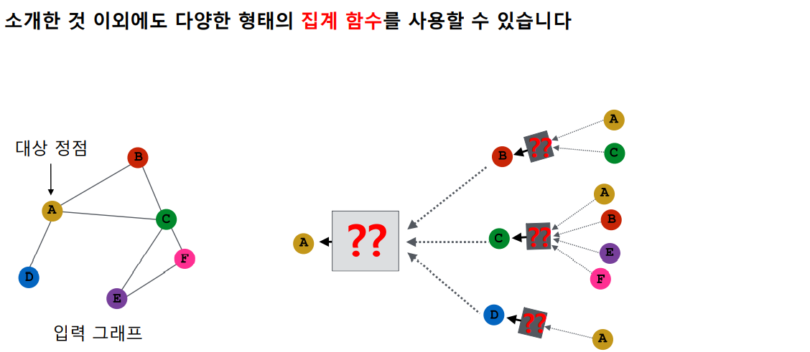
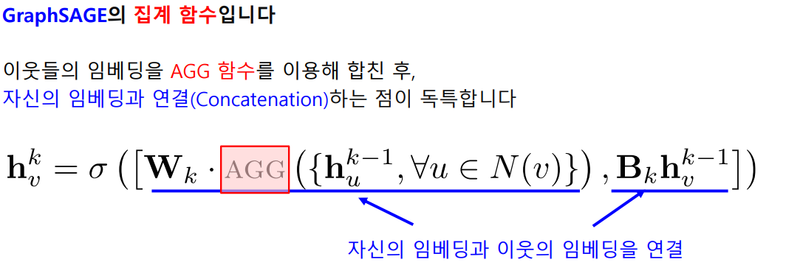
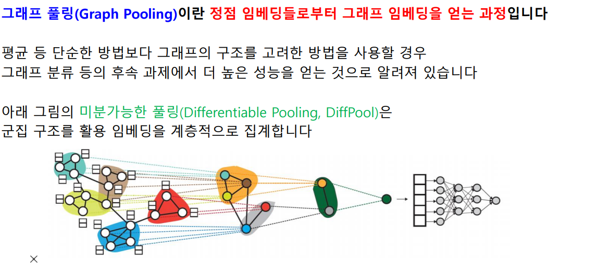

[toc]

# 210226

## 새로 배운내용

### GNN 기초

#### 정점 표현 학습 복습

##### 정점 표현 학습

##### 변환식 정점 표현 학습과 귀납식 정점 표현 학습

#### 그래프 신경망 기본

##### 그래프 신경망의 구조

층 별 집계 함수를 공유하는데, 층별로 받는 입력의 수가 다를 수 있다.

이것을 해결하기 위해 층별 집계 함수는 이웃들 정보의 평균을 구해서 신경망에 적용한다.[궁금한점](#그래프 신경망의 집계함수에서 평균말고 다른 함수를 적용하면 어떻게 될까?)

##### 그래프 신경망의 학습

##### 그래프 신경망의 활용

#### 그래프 신경망 변형

##### 그래프 합성곱 신경망

##### GraphSAGE

#### 합성곱 신경망과의 비교

##### 합성곱 신경망과 그래프 신경망의 유사성

##### 합성곱 신경망과 그래프 신경망의 차이

#### 실습: DGL 라이브러리와 GraphSAGE를 이용한 정점 분류

##### 데이터 불러오기

##### GraphSAGE 정의

##### GraphSAGE 학습

##### GraphSAGE 평가

#### 9강 정리

### GNN 심화

#### 그래프 신경망에서의 어텐션

##### 기본 그래프 신경망의 한계

##### 그래프 어텐션 신경망

#### 그래프 표현 학습과 그래프 풀링

##### 그래프 표현 학습

정점을 벡터로 표현하는 것이 아니라 그래프를 벡터로 표현하는 것이다.

##### 그래프 풀링

[궁금한점](#미분가능한 풀링은 뭘까?)

#### 지나친 획일화 문제

##### 지나친 획일화 문제

그래프 신경망의 층의 수가 증가하면 많은 정점의 정보를 취합하는 과정에서 대부분의 정점이 겹치게 된다.

##### 지나친 획일화 문제에 대한 대응

#### 그래프 데이터 증강

##### 그래프 데이터 증강

##### 그래프 데이터 증강에 따른 효과

#### 실습: GraphSAGE의 집계 함수 구현

##### 데이터 불러오기

##### GraphSAGE 구현

##### GraphSAGE 학습

##### GraphSAGE 평가

#### 10강 정리

## 참고용

[Semi-Supervised Classification with Graph Convolutional Networks](https://arxiv.org/abs/1609.02907) 

[A Comprehensive Survey on Graph Neural Networks](https://arxiv.org/pdf/1901.00596.pdf)

## 궁금한 점

### 그래프 신경망의 집계함수에서 평균말고 다른 함수를 적용하면 어떻게 될까?

[돌아가기](#그래프 신경망의 구조)

GraphSAGE를 참고하면 되겠다.

[GraphSAGE](#GraphSAGE)

### 그래프 합성곱 신경망에서 정규화 방법이 바뀐게 어떤 의미를 가질까?

이웃의 정보를 취합할때, 이웃의 이웃의 갯수를 고려해준다는 의미인가?

### 미분가능한 풀링은 뭘까?

