[toc]

# 210120

## 새로 배운내용

### 1.namedtuple

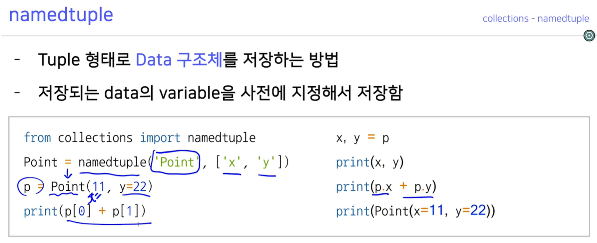

클래스를 만드는거랑 비슷해 보인다.

### 2.pprint

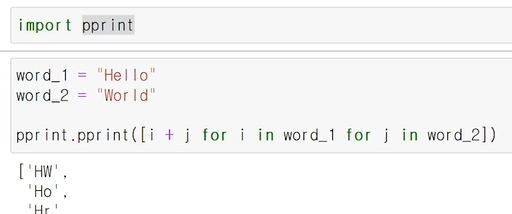

print를 사용하면 옆으로 길게 나오지만 pprint를 사용하면 이쁘게 출력된다.

### 3.map

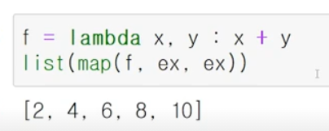

ex = [1, 2, 3, 4, 5]인데 map 함수에 2개 이상의 리스트를 넣을 수 있다.

### 4.reduce

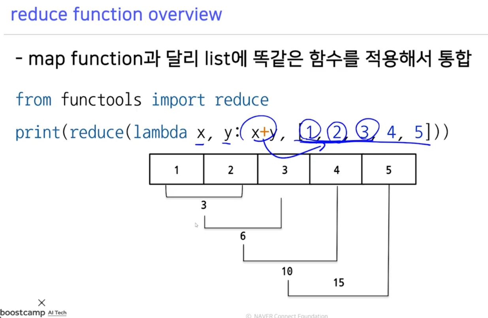

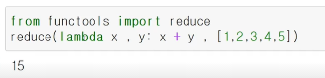

### 5,generator

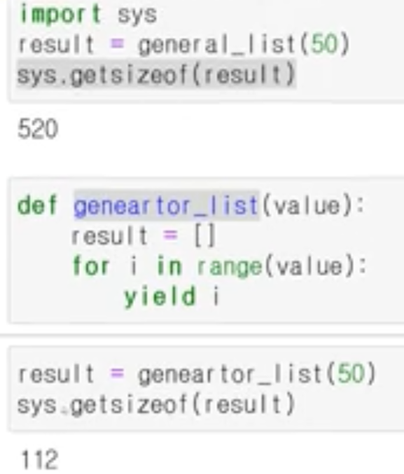

generator는 주소값만 가지고 있고 필요할 떄 메모리에 올린다.

## 참고용

### 1.collections

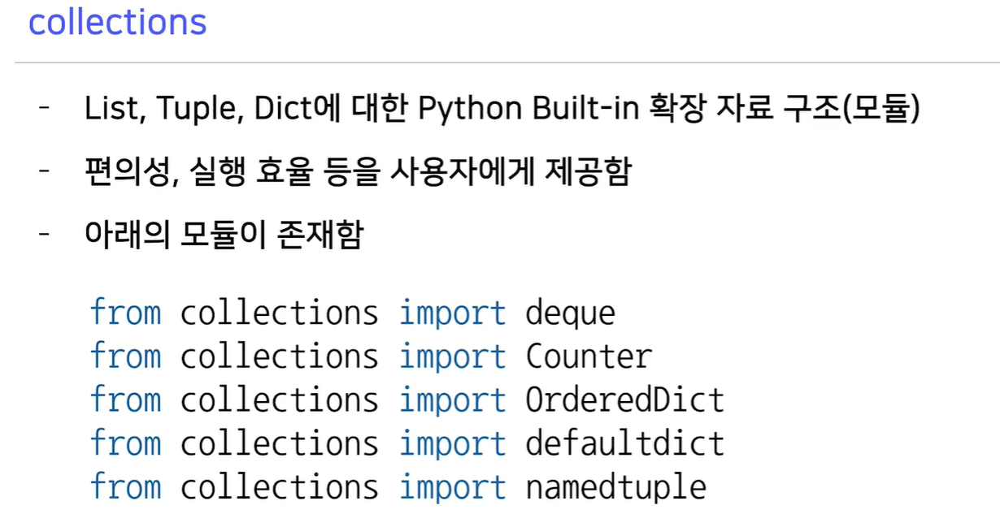

### 2.defaultdict

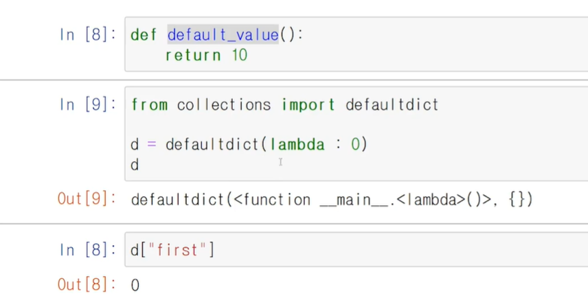

defaultdict의 초기값 설정은 생성시 함수 형태로 넣어줄 수 있다.

### 3.Counter

[궁금한 점](#1.Counter)

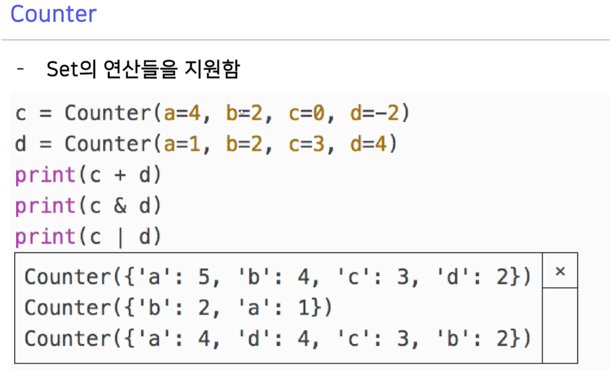

### 4.함수 인자 순서

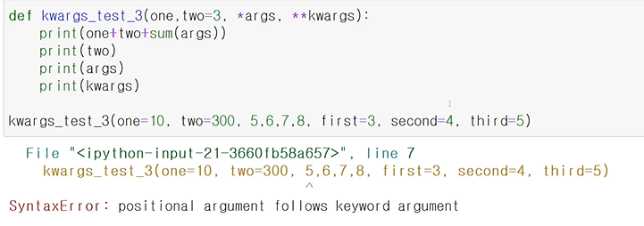

아래 순서대로 넣어야한다. 아니면 에러남

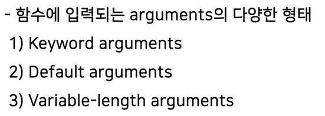

## 궁금한 점

### 1.Counter

[돌아가기](#3.Counter)

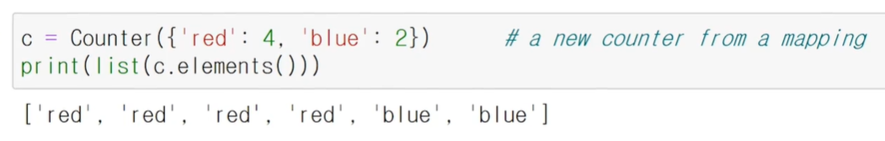

여기서 red 나 blue의 갯수가 음수일때는 어떻게 될까?

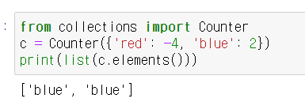

음수면 안보여준다.