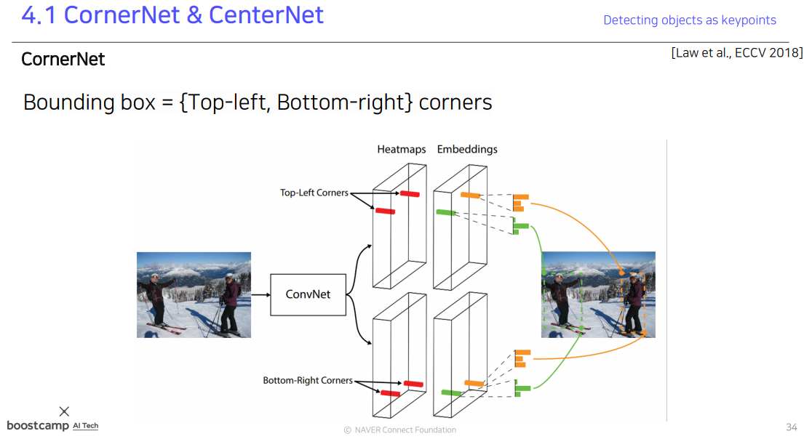
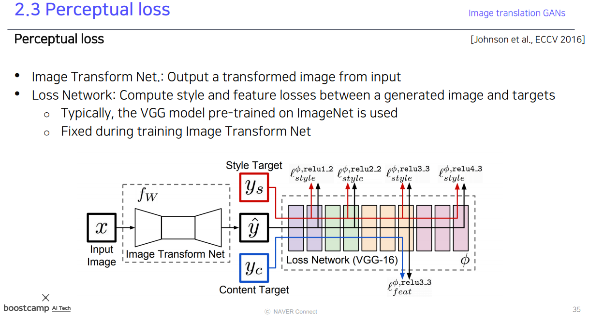
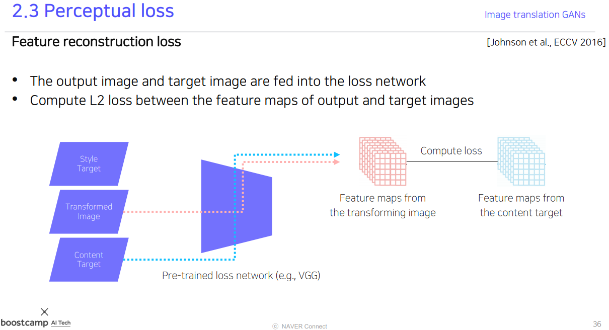

[toc]

# 210311

## 새로 배운내용

### Instance segmenters

#### Mask R-CNN

ROI pooling 대신 RoI Align을 사용했다.

class분류 결과를 가지고 mask를 참조한다.

#### YOLACT(You Only Look At CoefficienTs)

Mask의 프로토타입을 구하고, Coefficients를 구해서 선형결합을 구한다.

#### YolactEdge

뭔지 잘 모르겠다.

### Panoptic segmentation

instance segmentation은 배경에는 관심이 없었다.

#### UPSNet

#### VPSNet

이전 프레임에서 특징들을 가져온다.

### Landmark localization

#### coordinate regression vs heatmap classification

coordinate regression은 landmark를 직접 찾아내는 신경망이다.

부정확하고 일반화가 어렵다.

heatmap classification은 각 채널마다 하나의 Keypoint를 담당하게 되고 Key point가 발생할 확률을 히트맵으로 나타낸다.

성능이 더 좋지만 계산량이 많아진다.

#### Hourglass network

receptive field를 크게 가져가서 큰 영역을 보고 landmark를 찾아낸다.

skip connection을 통해서 low level feature를 보고 정확한 위치를 특정하게끔 유도한다.

skip conection시 또다른 conv layer를 통과한다.

#### DensePose

신체 모든 부위에 landmark를 입히면 3D모델이 될 수 있다.

#### RetinaFace

multi-task 학습을 통해 backbone network를 강하게 학습한다.

#### CornerNet

corner point를 추출하고, 같은 객체의 left-top corner의 embedding과 right-bottom corner의 embedding이 같은 표현을 하게 만들어 짝을 지어준다.

#### CenterNet(1)

#### CenterNet(2)

### Conditional generative model

무작위로 생성하는 것이 아니라 사용자의 의도가 담길 수 있어야 한다.

#### Super resolution

GAN을 사용하지 않고 CNN을 통해서 학습하는 방법도 있었지만 평균으로 회귀하는 성질이 있어서 GAN이 성능이 더 좋다.

### Image translations GANs

#### Pix2Pix

##### loss function

gan loss만 사용하면 입력사진과 무관한 사진이 생성될 수 있기때문에 L1 loss를 추가한다.

#### CycleGAN

비지도학습이다.

##### loss function

Cycle consistency loss가 없으면 입력과 상관없이 하나의 이미지로 만들 수 있다.

#### Perceptual loss

regression을 사용하는 방법보다 conditional GAN을 사용하는것이 더 품질이 좋은데 학습이 어렵다는 단점이 있다.

perceptual loss는 학습이 간단하고 코딩도 간편하지만 pre-trained model이 필요하다.

pre-trained model의 첫번째 layer의 필터를 살펴보면 사람의 지각과 비슷한 필터를 갖고있다고 한다. 여기서 아이디어를 얻어서 사람과 비슷하게 바라보는 perceptual space로 변환하는 transform이라고 생각한다.

loss network(pre-trained model)는 학습도중에 업데이트하지 않는다. 

Transformed image가 원래 image의 content를 담고 있는지에 대한 L2 loss

Transformed image가 원하는 style을 반영했는지에 대한 loss

style은 픽셀이 담고있는게 아니라 넓은 영역에서 나타나는 특징이기 때문에 픽셀별로 보는것이 아니라 풀링을 통해 값을 추출한다.

## 참고용

ROI Align

Gram matrices

## 궁금한 점

