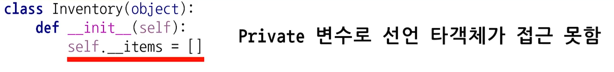
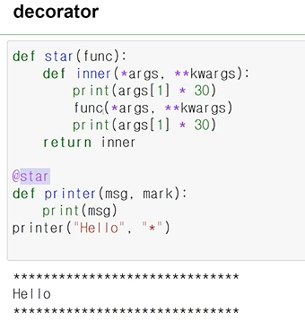
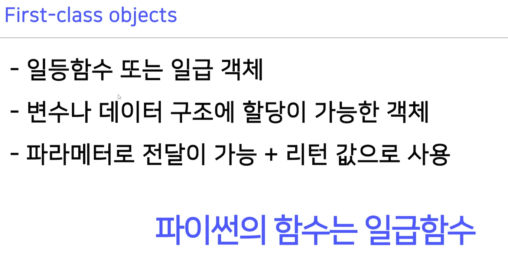

[toc]

# 210121

## 새로 배운내용

### 1.private variable



__를 붙여서 만들 수 있다.


접근이 필요할때 property 데코레이터를 이용하면 내부에서는 접근이 가능하다.

카피를 이용해서 전달해야 수정이 불가능하다. 위 사진처럼 전달하면 수정할수도 있음

### 2.Inner function


### 3.decorator



msg, mark 인자가 어떻게 넘어가는건지 잘 이해가 안간다. 어떻게  printer의 인자인데 func의 인자까지 넘어갈까?

printer가 star 안에 들어간다고 해서 'star(printer(msg, mark))구조인가?' 하고 생각해봤지만 

그러면 star(None)이랑 같기때문에 동작할리가 없다. (printer 함수는 리턴값이 None이니까)

star(printer)(msg, mark) 처럼 동작한다고 하면 뒤에 내용도 설명이 된다.


그러면 이 경우는

generate_power(2)(raise_two)(7) 라고 해석 할 수 있고 앞에서부터 풀어보면

generate_power(2)는 wrapper이고 exponent = 2인 상태를 리턴하므로
wrapper(raise_two)(7) 이고, exponent = 2이다.
wrapper는 inner를 리턴하고 raise_two를 파라미터로 받았기 때문에 결국
inner(7), f = raise_two이고 exponent = 2이다.
따라서 결과값은
exponent ** result 인데 
2 ** result 이고
result = f(7) = raise_two(7) = 49이므로
2 ** 49를 리턴하는것이다.


## 참고용

### 1.매직 메소드


```
__str__은 print(객체)를 했을때 무엇을 보여줄지
__add__는 같은 객체끼리 + 연산을 했을때 어떤 값을 리턴할지 정할 수 있다.
```

### 2.일급객체



### 3.콘다 가상환경 만들기


함수를 파라미터로 전달해서 사용가능


## 궁금한점

### 1.super()


다중 상속을 받으면 super()는 어떤 부모클래스를 가리킬까?


이 사진을 보면 첫번째 부모를 가리키는 것 같다.

찾아보니 다른 부모의 메소드를 사용하고 싶을때는  아래처럼 부모클래스의 이름을 입력하고 self를 넣어주어야 한다고 한다.


### 2.절대참조 위치


game이 어디서부터 시작하는걸까?

자기가 속해있는 패키지 내의 최상단이다.

