[toc]

# 210122

## 새로 배운내용

### 1.pathlib

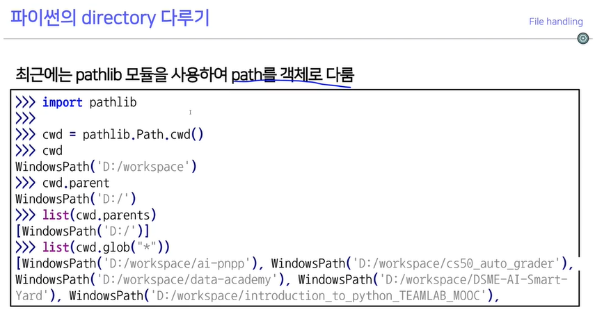

path를 객체로 다루어서 접근이 용이하다.

### 2.pickle

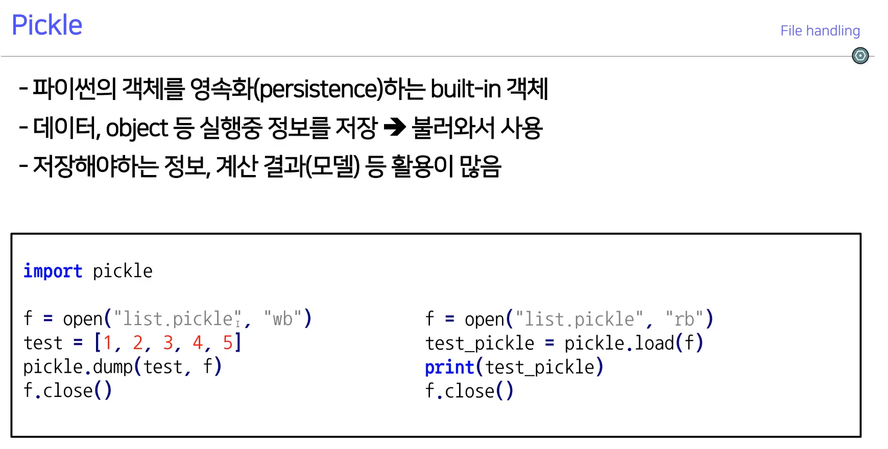

객체를 저장하고 불러올 수 있다.

### 3.logging

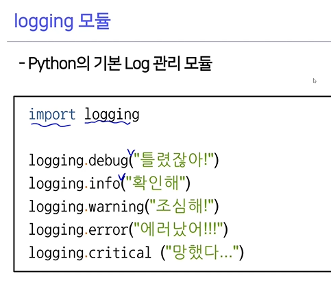

로그를 남기고 분석할 수 있다.

### 4.config parser

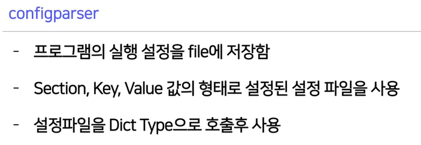

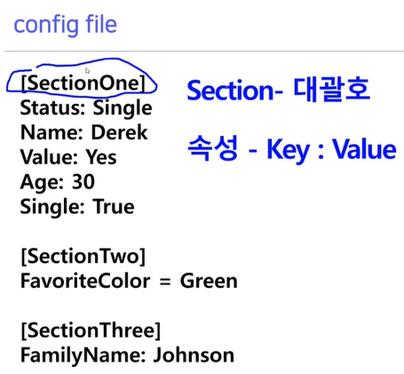

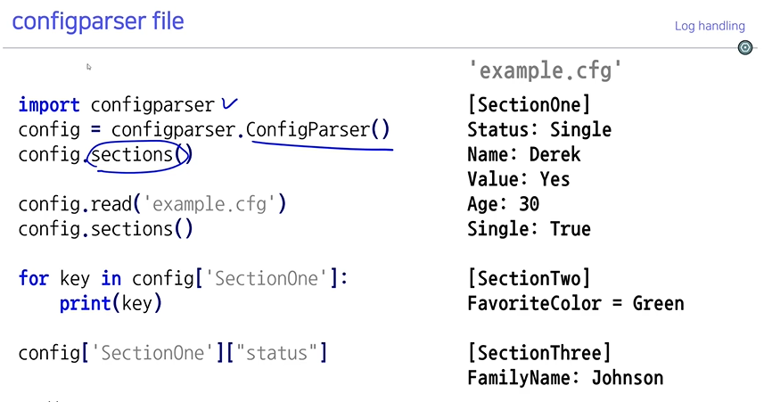

config 파일을 만들어서 설정을 저장하고 불러와서 모듈을 실행시킬 수 있다.

argparser는 실행시점에 command를 이용해서 설정을 지정한다.

아래는 예시

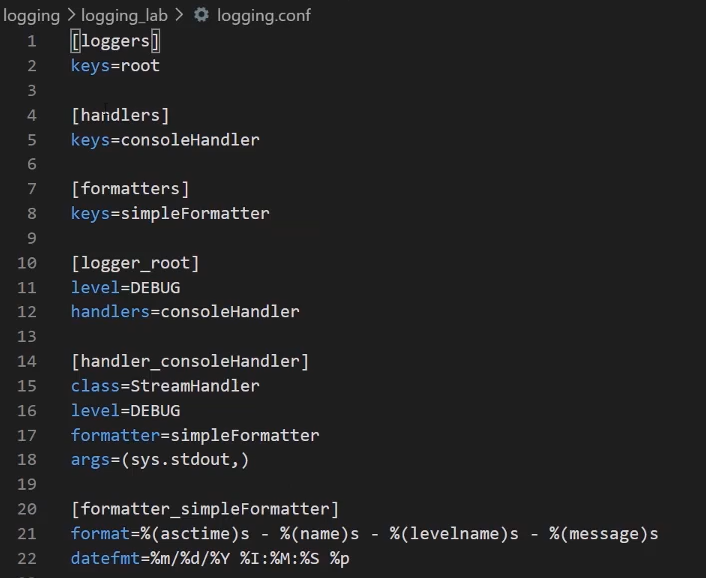

### 5.csv 객체

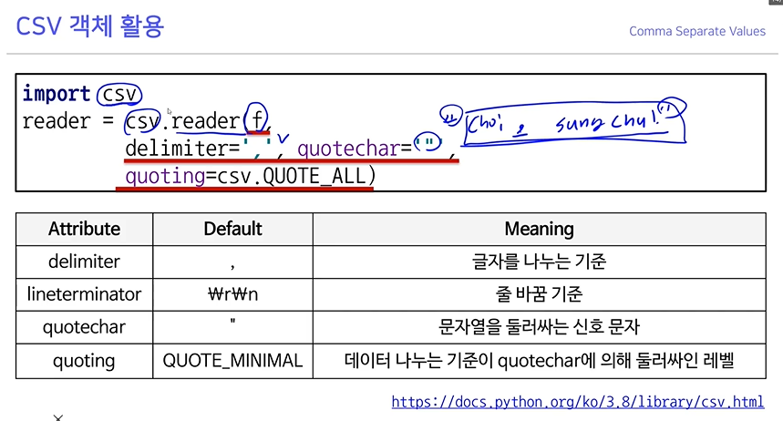

quotechar를 설정하면 quotechar로 둘러 쌓여있는 부분은 delimiter가 있어도 잘라내지 않는다.

## 참고용

### 1.raise, assert

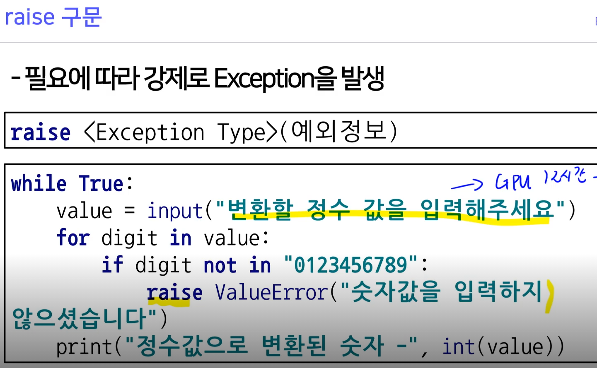

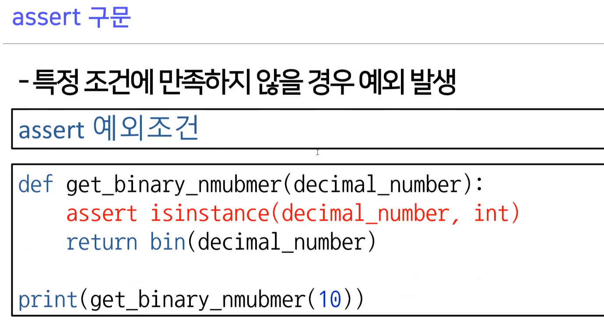

### 2.file write

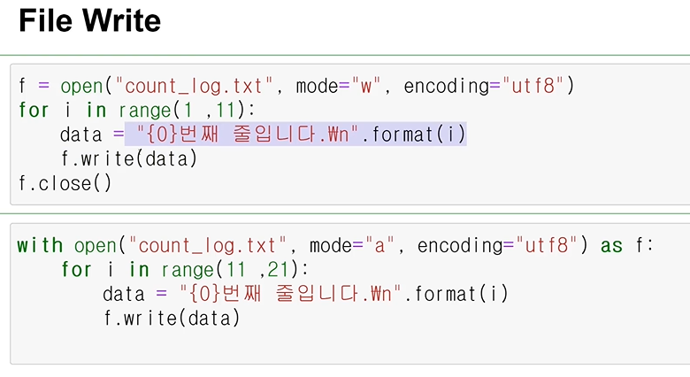

인코딩 설정해주는거 까먹지않기

### 3.logging level

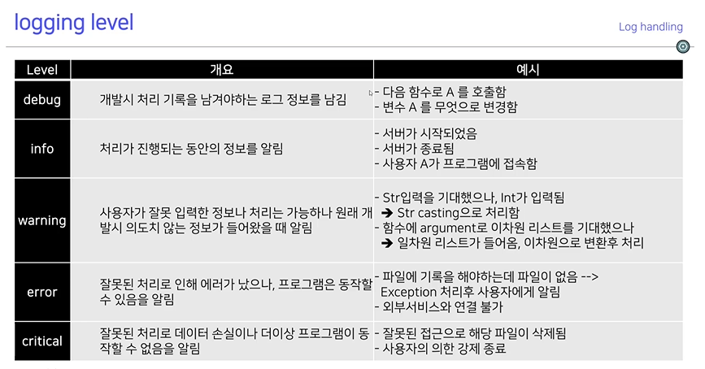

파이썬의 logging level은 기본적으로 warning부터 보여준다.

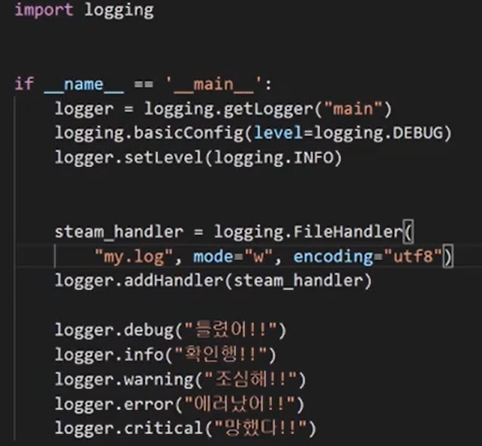

setLevel은 옛날방식이고, stream_handler를 이용해 화면에 출력만 하는 것이 아니라 파일로 남길 수 있음

### 4.logging formmater

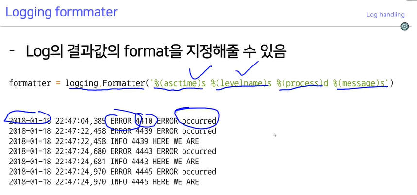

logging formmater를 이용해서 로그를 깔끔하게 남기자

### 5.encoding="cp949"

윈도우에서는 기본적으로 인코딩이 cp949로 돼있고, vscode는 utf-8로 돼있기 때문에 아래처럼 안보일 수가 있기 때문에 cp949로 읽는것

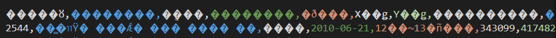

### 6.u"한글"

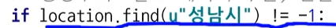

u는 유니코드를 뜻하고 한글을 사용할때는 붙여주는 것이 좋다.

### 7.csv 데이터 저장

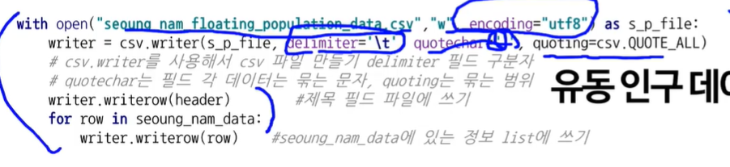

quotechar와 delimiter를 설정할 수 있고, 인코딩은 왠만하면 utf8로 저장하자

## 궁금한 점

딱히 없음