[toc]

# 210125

## 새로 배운내용

### 1.np.newaxis

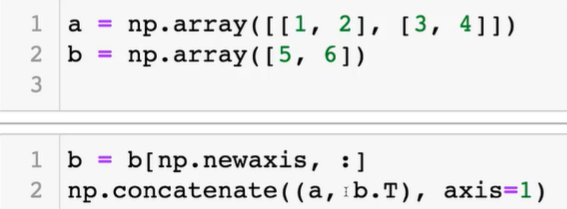

### 2.무어-펜로즈 역행렬

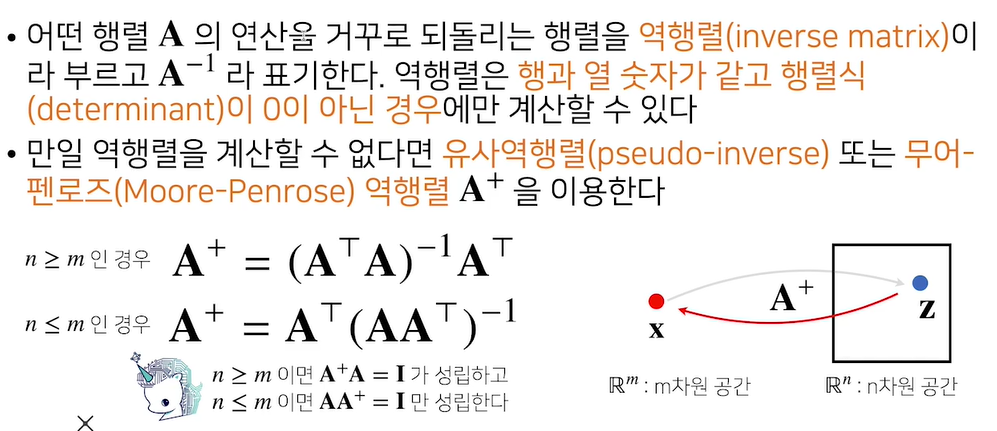

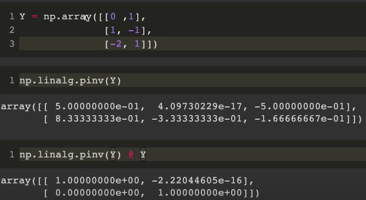

## 참고용

### 1.np.array 사용시 dtype 필수로 적어줘야함

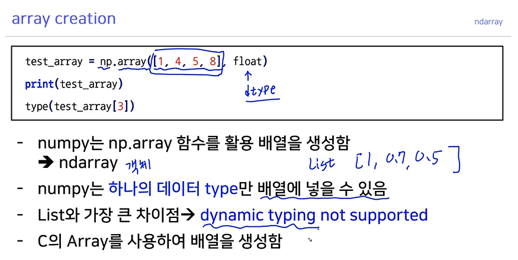

### 2.ndarray slicing

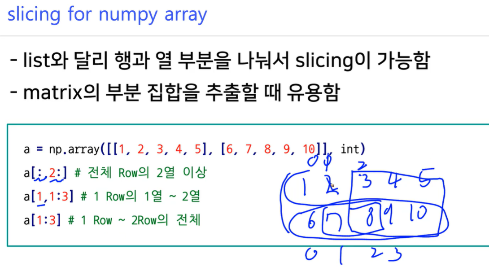

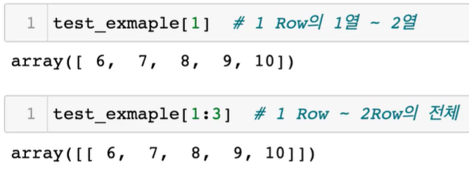

들어있는 값은 같지만 차원이 다르다.

스텝도 사용가능

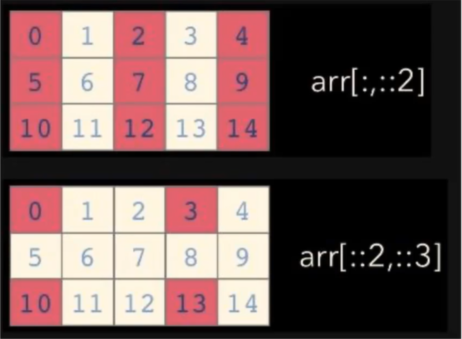

### 3.np.arange

스텝으로 소수도 가능하다.

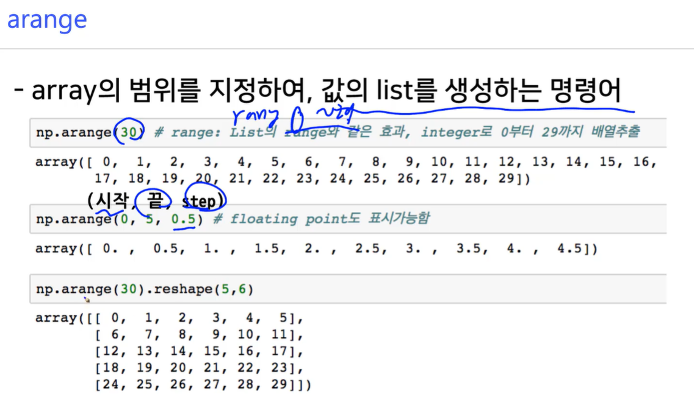

### 4.ones, zeros, empty

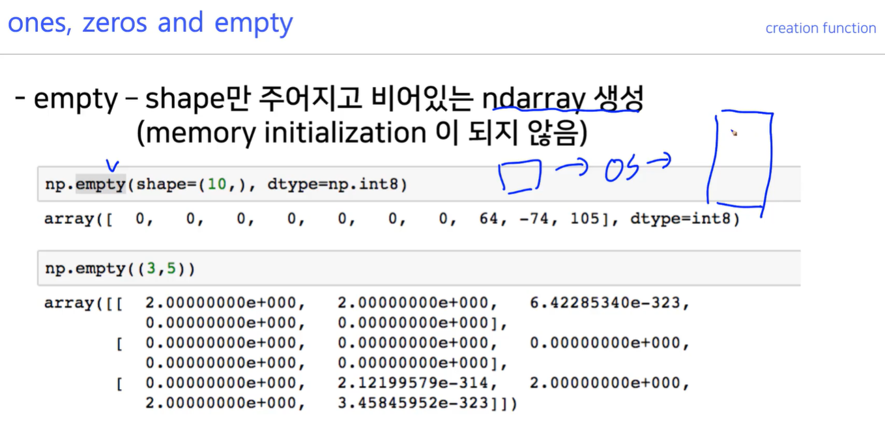

### 5.something_like(ones, zeros, empty)

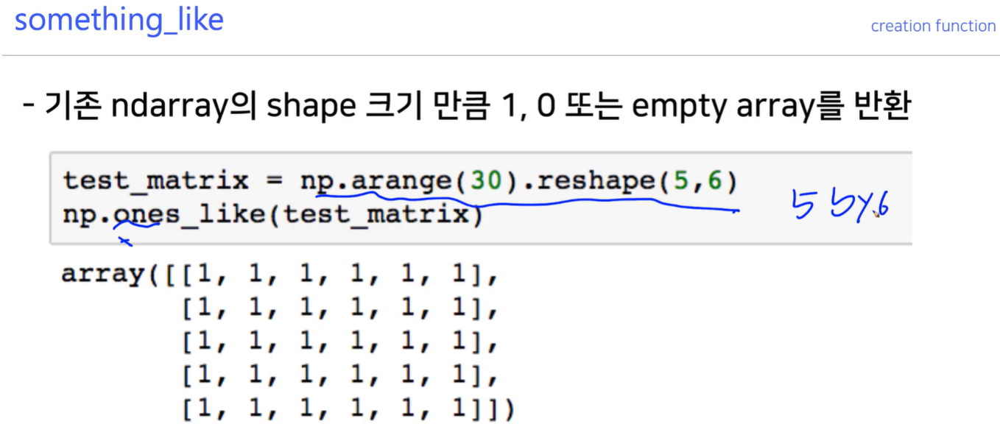

### 6.idemtity, eye, diag

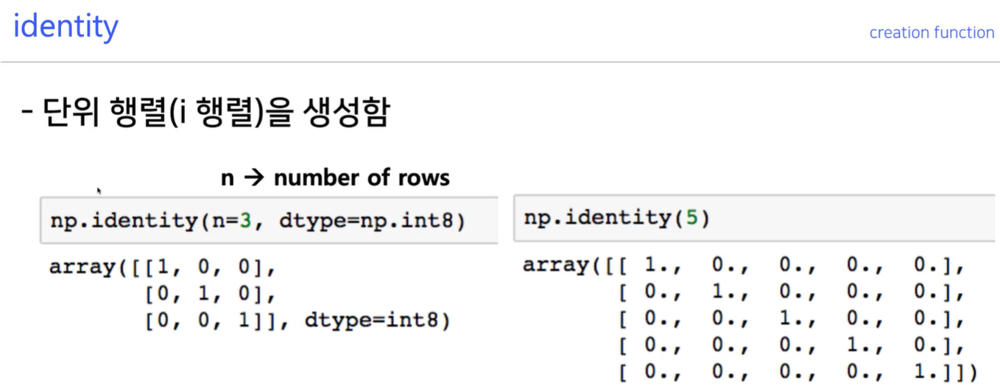

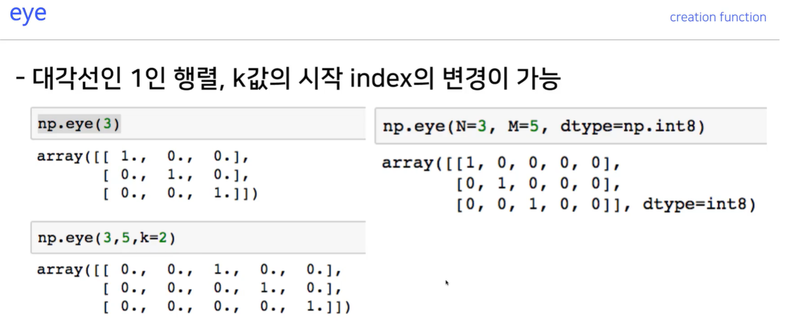

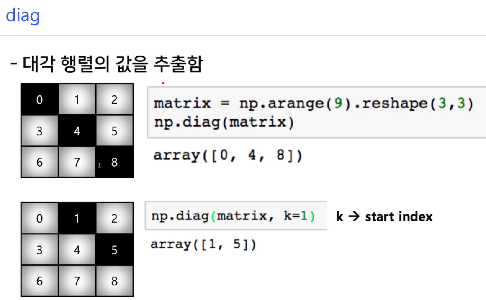

### 7.random sampling(uniform, normal)

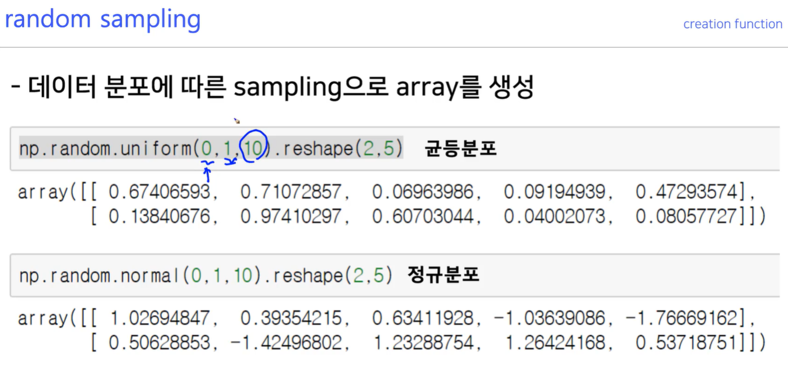

### 8.axis

axis는 계산을 진행하는 축이다.

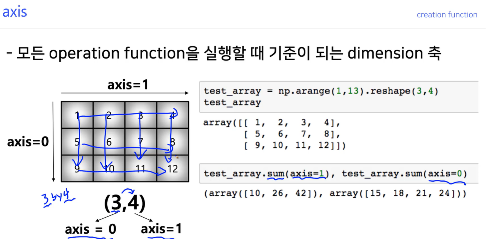

### 9.concatenate(vstack, hstack, axis)

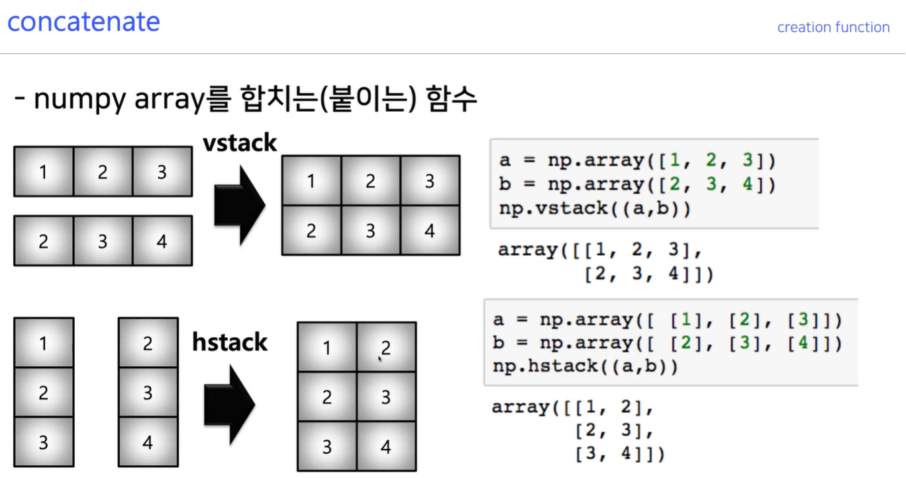

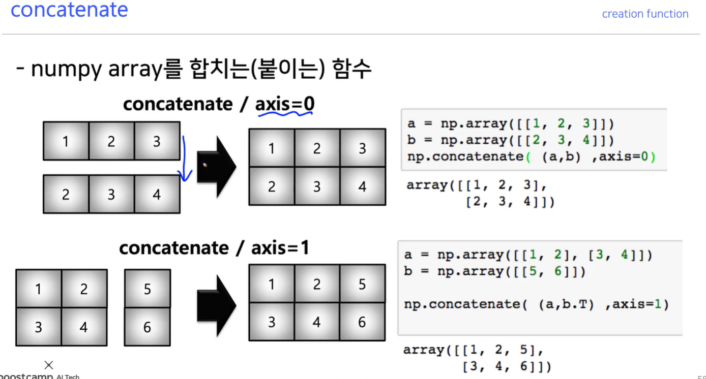

### 10.dot product

np.array의 기본 연산은 같은위치의 연소끼리 연산이다.

dot product를 하려면 메소드를 사용

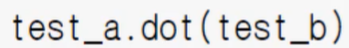

### 11.np.linalg.inv (역행렬)

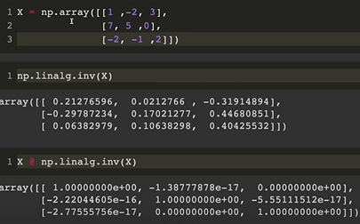

## 궁금한 점

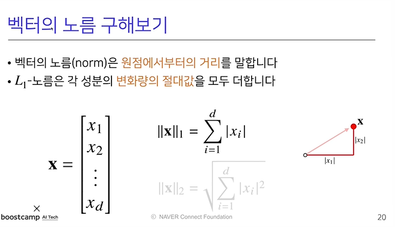

ln norm 에서 n은 양의 정수만 사용하나?

기계학습에서는 학습의 목적에 따라 다른 거리공간을 사용한다고 한다.

데이터의 특징을 고려해서 거리공간을 설계해야 하는듯 함

