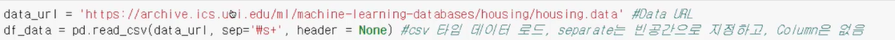
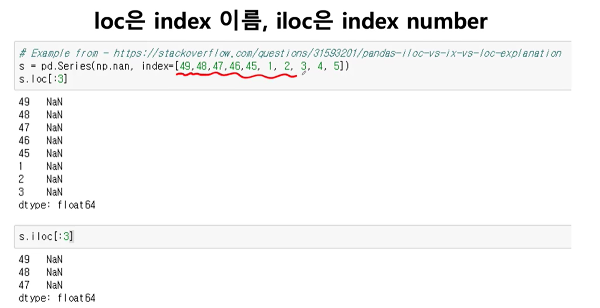

[toc]

# 210127

## 새로 배운내용

sep에 정규표현식이 사용가능한것 같다.

\s는 빈 공간을 의미한다.

## 참고용

### 1.loc, iloc

- Dive into Deep Learning, Zhang et al., [4.7 Forward Propagation, Backward Propagation, and Computational Graphs](https://d2l.ai/chapter_multilayer-perceptrons/backprop.html) (영문)
- Dive into Deep Learning, Zhang et al., [3.14 순전파(forward propagation), 역전파(back propagation), 연산 그래프](https://ko.d2l.ai/chapter_deep-learning-basics/backprop.html) (한글)

## 궁금한 점

