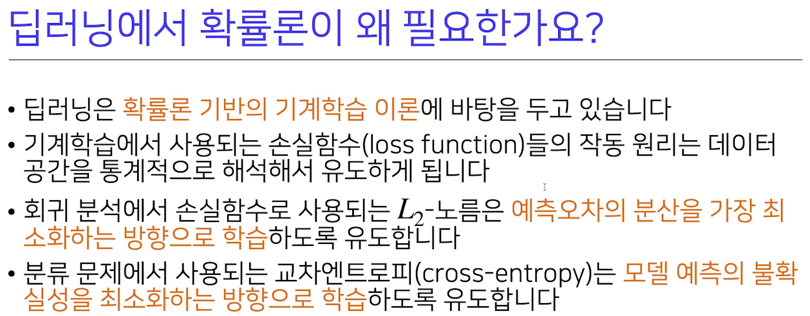
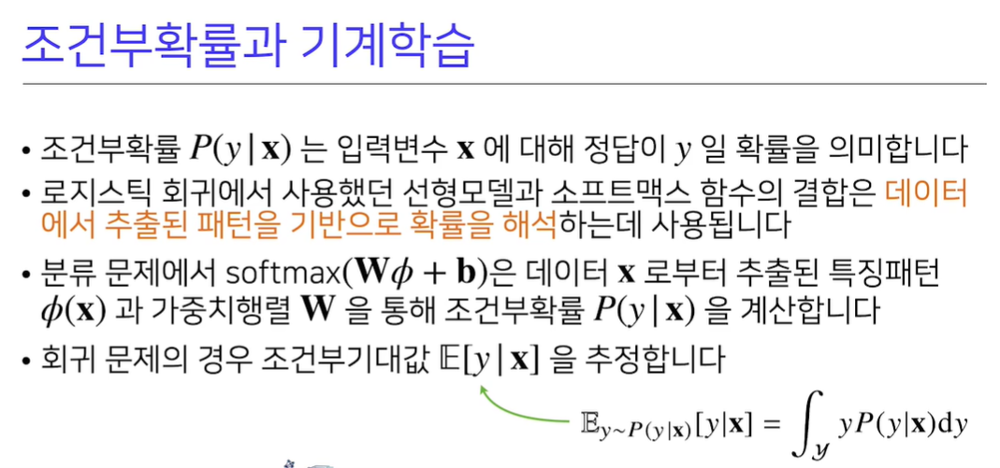
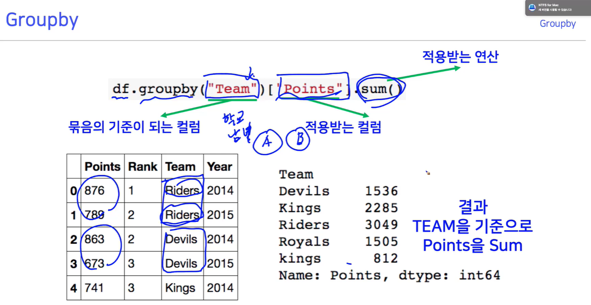
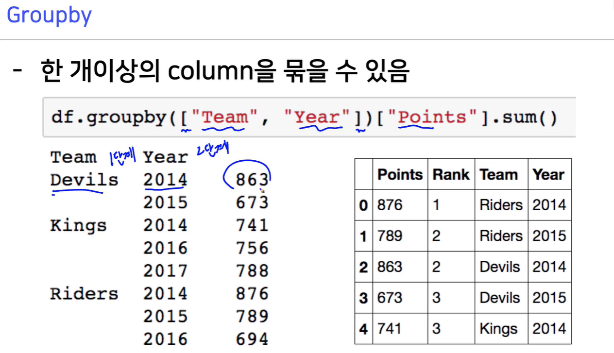
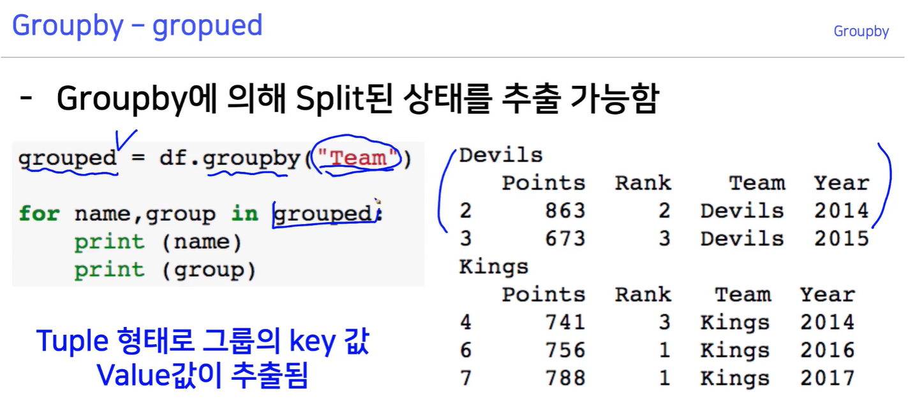

[toc]

# 210128

## 새로 배운내용

### 1.손실함수의 선택

어떤 손실함수를 사용할지는 어떤 값을 최소화 할지와 연관된다.

(L2-norm을 손실함수로 사용하면 오차의 분산을 최소화 한다.)

조건부 기대값이 L2-norm 을 최소화하는 함수와 일치하기 때문에 회귀문제의 경우 L2-norm 을 사용한다.

## 참고용

### 1.Group by 사용법

## 궁금한 점

